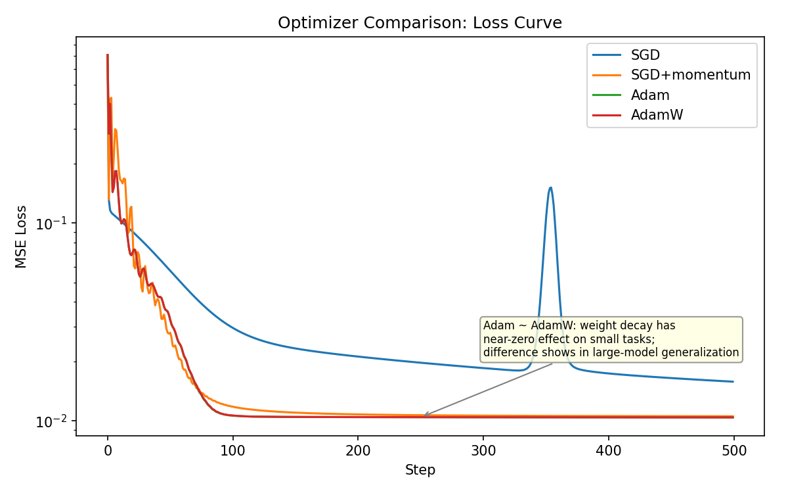
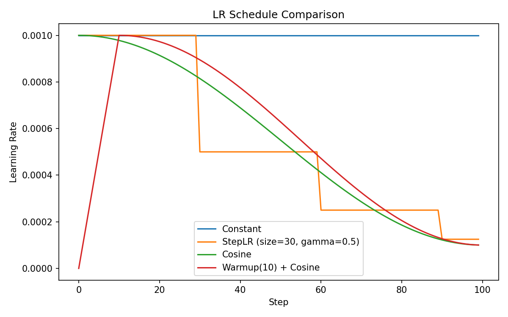

# ch04 · 神经网络与训练要素

> ch03 把"前向 + 反向 + 优化"模板背下来了。本章把模板里**每一颗螺丝**单独拧一拧：
> 初始化、优化器、学习率调度、Dropout、归一化（BN/LN）。
> 这些是后面 Transformer 训练能不能稳定收敛的决定性因素。

## 学习目标

1. 理解为什么"初始化错了 → 训不动"，能区分 Xavier vs He vs 朴素初始化
2. 区分 SGD / SGD+momentum / Adam / AdamW 的核心差异，知道何时用哪个
3. 理解 LR 调度的"为什么"，能解释 cosine / step / warmup 的动机
4. 解释 Dropout 在训/推阶段的差异；理解为什么 LLM 全用 LayerNorm 而非 BatchNorm

## 前置依赖

- ch02（链式法则 / 梯度直觉）、ch03（PyTorch 训练循环模板）

---

## 1. 反向传播的工程视角

ch02 把反向传播当数学讲。本节把它当**工程问题**看：每个工程细节背后都有一个"如果不这样做就翻车"的故事。

### 1.1 计算图复用与 retain_graph

PyTorch 的计算图**默认 backward 一次就被释放**（省显存）。再 backward 会报：

```
RuntimeError: Trying to backward through the graph a second time
```

99% 训练场景一次足够。需要多次反传同一张图（典型如 GAN（Generative Adversarial Network，生成对抗网络）：同一份 fake_data 既要更新 G 又要更新 D；或一个 loss 拆两次反传；或算高阶梯度）才用 `loss.backward(retain_graph=True)`。M3 不会遇到，混个眼熟。

### 1.2 zero_grad 必须在 backward 之前

ch03 §2.2 已强调。再补一个细节：`set_to_none=True`（PyTorch 1.7+ 默认就是这个）。

```python
optimizer.zero_grad()                # 等价于 optimizer.zero_grad(set_to_none=True)
```

`set_to_none=True` 直接把 `.grad` 设回 `None`，比"填零"（PyTorch < 1.7）更省一次显存写入；唯一区别是某些自定义优化器需要先判 `if p.grad is not None`。

### 1.3 梯度爆炸 / 消失：用数值看

不做任何归一化的深网络，前向激活值会指数级炸或衰减。最快诊断方法：每隔几步打印各层梯度范数：

> 此处的归一化：指对网络中间层激活值（activations，即每层线性/卷积输出后的中间张量）的归一化。不是对输入数据、不是对权重、不是对梯度。

```python
for name, p in model.named_parameters():
    if p.grad is not None:
        print(f"{name}: grad_norm={p.grad.norm().item():.3e}")
```

经验阈值：

- `< 1e-7` → 梯度消失（学不动）
- `> 1e3` → 梯度爆炸（很快变 nan）
- `nan / inf`（NaN = Not a Number、Inf = Infinity，浮点非法值/无穷大） → 已经爆了，回退到上一个 ckpt（checkpoint，模型权重检查点）+ 减小 lr / 加 grad clip

**Gradient clipping** 是常用救命药：

```python
torch.nn.utils.clip_grad_norm_(model.parameters(), max_norm=1.0)  # 在 step() 之前调
```

意思：把所有参数梯度看成一个长向量，范数超过 1.0 就等比例缩放回 1.0。

> grad clip 是**事后救火**——梯度炸了再削。下一节讲的初始化是**事前防火**：从源头让每层激活/梯度方差稳定，避免一上来就爆。两者通常一起用。

---

## 2. 参数初始化

> 一句话：**初始化 ≠ 锦上添花，是网络能不能训起来的前提**。
> 直觉：每层输出方差应保持稳定，否则前向几层就炸/消，反向梯度同理。

### 2.1 三档对照

| 方案 | 公式（fan_in 是输入维度） | 配什么激活 |
|---|---|---|
| 朴素正态 $\mathcal{N}(0, 1)$ | std = 1 | **不要用**，几层就炸 |
| LeCun（Yann LeCun，Xavier 简化版） | std = $\sqrt{1/\mathrm{fan\_in}}$ | sigmoid / tanh |
| Kaiming（何恺明，又叫 He 初始化） | std = $\sqrt{2/\mathrm{fan\_in}}$ | ReLU 系（含 GELU（Gaussian Error Linear Unit，高斯误差线性单元） / SiLU（Sigmoid Linear Unit，S 形线性单元）） |

> 严格说 Xavier（Xavier Glorot，Glorot 初始化）的完整式是 $\sqrt{2/(\mathrm{fan\_in} + \mathrm{fan\_out})}$，同时让前向激活与反向梯度方差都稳定。在 fan_in ≈ fan_out 时与上面 LeCun 形式接近，本章用单 fan_in 简化。

ReLU 把负半轴砍掉，输出方差减半，所以 He 比 Xavier 多了个 $\sqrt{2}$ 系数补回来。

### 2.2 PyTorch 默认初始化

`nn.Linear` 默认走 **Kaiming 均匀**（uniform 版的 He）。`nn.Conv2d` 同。所以**普通 MLP（Multilayer Perceptron, 多层感知器）/CNN（Convolutional Neural Network，卷积神经网络）你不动它就对了**。

需要手动初始化的场景：

```python
def init_weights(m: nn.Module) -> None:
    if isinstance(m, nn.Linear):
        nn.init.kaiming_normal_(m.weight, nonlinearity="relu")
        if m.bias is not None:
            nn.init.zeros_(m.bias)

model.apply(init_weights)  # 递归遍历所有 submodule
```

LLM 训练里更常见的是 GPT-2 / LLaMA 风格初始化（小标准差如 0.02），M2 ch06 会再讲。

### 自检

1. 用朴素 $\mathcal{N}(0, 1)$ 初始化一个 10 层 ReLU MLP，前向第几层激活会爆？
2. 为什么 He 比 Xavier 多个 $\sqrt{2}$？

<details markdown="1">
<summary>答案速查</summary>

1. 大约 4–5 层后激活值数量级开始失控。可以用 `01_init_compare.py` 实测

2. ReLU 砍掉负半轴 → 输出方差变成原来的 1/2 → 要把方差扩大 2 倍补回来 → std 乘 $\sqrt{2}$

</details>

---

## 3. 优化器

### 3.1 四档主流对照

| 优化器 | 一句话特性 | 何时用 |
|---|---|---|
| **SGD**（Stochastic Gradient Descent，随机梯度下降） | 纯梯度下降 | 简单凸问题、教学；现代深网络极少单独用 |
| **SGD + momentum** | 累积"惯性方向"，跨过窄峡谷 | 视觉任务（ResNet 时代）、LLM 预训练偶见 |
| **Adam**（Adaptive Moment Estimation，自适应矩估计） | 一阶矩 + 二阶矩自适应学习率 | NLP（Natural Language Processing，自然语言处理） / Transformer 默认 |
| **AdamW**（Adam with decoupled Weight decay，权重衰减解耦版 Adam） | Adam 的 weight decay 修正版 | **LLM 预训练 / SFT（Supervised Fine-Tuning，监督微调）的事实标准** |

> 走势图（运行 `Playground/ch04-nn-training/02_optimizer_compare.py --plot` 生成）：
>
> 

### 3.2 momentum 的直觉

```
普通 SGD：       w ← w - lr · g
SGD + momentum：v ← β·v + g
                w ← w - lr · v
```

`v` 是梯度的指数滑动平均（β 通常 0.9）。**累积同向梯度**让步子变大、抵消反向噪声。直觉：滚下山的小球积攒动量，能冲过小坑。

### 3.3 Adam = momentum + 自适应学习率

§3.2 的 momentum 只解决了"方向平滑"。但不同参数的梯度量级可能差几个数量级——某些参数梯度天天 0.001，另一些天天 10。用同一个 lr 更新，小梯度的参数永远追不上。

Adam 的思路：**给每个参数一个独立的有效学习率**。

它维护两个滑动平均（每个参数各一份）：

- $m$：梯度的滑动均值（= momentum，方向信号）
- $v$：梯度**平方**的滑动均值（= 衡量这个参数的梯度"波动有多大"）

```
m ← β₁·m + (1-β₁)·g          # 方向（同 momentum）
v ← β₂·v + (1-β₂)·g²         # 幅度（g² 是逐元素平方）
w ← w - lr · m / (√v + ε)     # 更新
```

> β₁（典型 0.9）= $m$ 的滑动系数，功能等同 §3.2 momentum 的 β，控制方向平滑。
> β₂（典型 0.999）= $v$ 的滑动系数，Adam 独有，控制波动估计的记忆长度。β₂ 更大意味着 $v$ 变化更缓慢、估计更稳定。

关键在最后一行的 $\frac{m}{\sqrt{v}}$：

- 某参数梯度**波动大**（$v$ 大）→ $\sqrt{v}$ 大 → 除以大数 → **步子变小**（别冲过头）
- 某参数梯度**波动小**（$v$ 小）→ $\sqrt{v}$ 小 → 除以小数 → **步子变大**（加速追上）

**数值例子**：参数 A 梯度平方均值 $v_A = 100$，参数 B 的 $v_B = 0.01$。
有效步长比 = $\frac{1/\sqrt{100}}{1/\sqrt{0.01}} = \frac{0.1}{10} = 1:100$。
Adam 自动给 B 的学习率放大了 100 倍——这就是"自适应"。

> $\epsilon$（典型 1e-8）防分母为零。
> 训练初期 $m, v$ 从 0 开始偏小，Adam 有 bias correction 修正（PyTorch 内部实现，使用者无感）。

### 3.4 过拟合、正则化与 weight decay

**过拟合（Overfitting）**：模型在训练集上 loss 很低，但在新数据上表现差。本质是模型"背答案"而非学规律。参数越多、模型越大，越容易过拟合。

**正则化（Regularization）**：所有用来对抗过拟合的手段的统称。核心思路：给模型加约束，限制它的"自由度"，逼它学到更泛化的解。常见手段包括 Dropout（§5）、数据增强、早停（early stopping）、以及本节要讲的 **weight decay**。

**L2 正则**：最朴素的正则化之一。在 loss 后面加一项惩罚权重大小的东西：

$$
\text{total_loss} = \text{task_loss} + \frac{\lambda}{2}\|w\|^2
$$

直觉：权重越大惩罚越重 → 逼模型用尽量小的权重完成任务 → 不容易在某几个参数上"押重注"去记住训练样本。

对 $w$ 求导，L2 项贡献一个额外梯度 $\lambda w$，更新变成：

```
w ← w - lr·g - lr·λ·w
```

最后那项 $-lr \cdot \lambda \cdot w$ 每步把权重往 0 拽一点——所以也叫 **weight decay**（权重衰减）。在普通 SGD 里，L2 正则和 weight decay **数学完全等价**。

> LLM 预训练几乎必加 weight decay（典型 $\lambda = 0.1$）。模型太大、数据虽多但参数更多，不加容易过拟合。

### 3.5 AdamW：weight decay 的正解

上一节得到结论：SGD + L2 = SGD + weight decay，每个参数被均匀衰减，没问题。

**但 Adam 里加 L2 就出问题了。**

回忆 Adam 的更新（§3.3）：

```
m ← β₁·m + (1-β₁)·g
v ← β₂·v + (1-β₂)·g²
w ← w - lr · m / √v
```

现在加 L2 正则，梯度从 $g$ 变成 $g + \lambda w$：

```
m ← β₁·m + (1-β₁)·(g + λ·w)
v ← β₂·v + (1-β₂)·(g + λ·w)²
w ← w - lr · m / √v              # λ·w 的效果也被 1/√v 缩放了
```

weight decay 的实际力度变成了 $lr \cdot \lambda w / \sqrt{v}$——被 $v$ 控制了。

**这导致反直觉的结果：**

- 波动大的参数 → $v$ 大 → $1/\sqrt{v}$ 小 → **decay 被削弱**（最不稳定的参数反而最少被约束）
- 波动小的参数 → $v$ 小 → $1/\sqrt{v}$ 大 → **decay 被放大**（本来就稳定的参数反而被过度约束）

这和"正则化应该约束不稳定参数"的初衷完全相反——这就是 Adam + L2 的已知缺陷。

**AdamW 的修法**：把 weight decay **从梯度通路中拿出来**，不经过 $\sqrt{v}$ 缩放，直接在参数上减：

```
w ← w - lr · m/√v       ← Adam 正常更新（梯度部分）
w ← w - lr · λ · w      ← weight decay（独立扣，不被 √v 影响）
```

每个参数被**均匀衰减**，与波动幅度无关。回到了 SGD 里 weight decay 的正确行为。

LLM 预训练几乎一律 AdamW。PyTorch 一行：

```python
optimizer = torch.optim.AdamW(model.parameters(), lr=3e-4, weight_decay=0.1)
```

> **与 ch03 的对照**：ch03 MNIST 用的是 `Adam(lr=1e-3)` 不带 weight decay——小模型小数据可以省。本节配置面向 LLM 预训练，M3 起一律 AdamW。
>
> **`param_groups` 一瞥**：实操中 LayerNorm（§6 详讲）参数和 bias 通常**不加** weight decay（它们维度小、加正则反而伤性能），靠 `optimizer = AdamW([{"params": decay, "weight_decay": 0.1}, {"params": no_decay, "weight_decay": 0.0}], lr=3e-4)` 分组配置。M3 ch09 详解。

### 自检

1. 同一个网络用 SGD 和 Adam，初始 lr 一般谁大？为什么？
2. 为什么 LLM 预训练用 AdamW 而不是 Adam？

<details markdown="1">
<summary>答案速查</summary>

1. SGD 大（典型 1e-2 ~ 1e-1），Adam 小（典型 1e-4 ~ 1e-3）。Adam 自带 $1/\sqrt{v}$ 自适应放大，名义 lr 已被隐式放大，需要手动调小

2. Adam 的 weight decay 实现等价于"波动大的参数被较少正则化"，与正则化目的相反；AdamW 把 weight decay 与梯度更新解耦，对大模型泛化和稳定性更友好

</details>

---

## 4. 学习率调度

固定 lr 的两个问题：

- 前期太大 → 震荡 / 发散；前期太小 → 收敛慢
- 后期太大 → loss 在最小值附近徘徊；后期太小 → 早期就这样

解法：**lr 随训练动态变化**。

### 4.1 三种常见 schedule

| 名称 | 形状 | 用法 |
|---|---|---|
| **StepLR** | 阶梯式衰减（每 N 步乘 0.1） | 简单 / 视觉任务老牌 |
| **CosineAnnealing** | 余弦曲线从 max → min | LLM 预训练默认 |
| **Warmup + Cosine** | 前 K 步线性升到 max，再 cosine 衰减到 min | LLM 预训练事实标准 |

> 走势图（运行 `Playground/ch04-nn-training/03_lr_schedule.py --plot` 生成）：
>
> 

### 4.2 为什么 LLM 都要 warmup

训练前期参数随机，梯度方差极大。直接上高 lr 容易把参数推到"再也回不来"的位置。warmup（前几百到几千步线性升 lr）让网络先"探探路"再放开。

伪代码骨架：

```python
def get_lr(step: int, warmup_steps: int, total_steps: int, lr_max: float, lr_min: float) -> float:
    if step < warmup_steps:
        return lr_max * step / warmup_steps                              # 线性 warmup
    progress = (step - warmup_steps) / (total_steps - warmup_steps)
    return lr_min + 0.5 * (lr_max - lr_min) * (1 + math.cos(math.pi * progress))  # cosine
```

PyTorch 提供 `torch.optim.lr_scheduler.CosineAnnealingLR`、`OneCycleLR` 等开箱方案，**M4 训 echo-mini 时手写一份**就行。

### 自检

1. warmup 期可以省吗？跳过会怎样？
2. cosine 衰减到的 `lr_min` 一般取多少？为什么不直接到 0？

<details markdown="1">
<summary>答案速查</summary>

1. 小模型 / 小数据可以省。大模型一旦省了，前几百步极易 loss 飞到 nan，没救只能从头来。代价比加几行 schedule 高得多

2. 通常取 `lr_max` 的 1/10（如 max=3e-4 → min=3e-5）。直接到 0 后期等于不学，浪费算力且有时反而 loss 反弹

</details>

---

## 5. Dropout

### 5.1 训练时随机丢神经元

```python
nn.Dropout(p=0.5)                                # 训练时以概率 p 把激活置 0
```

直觉：强迫网络不要依赖某些"明星神经元"，提升泛化。

> **为什么能提升泛化**：每次前向传播随机丢掉不同的神经元，等于每次训练的是一个不同的"子网络"（原网络的子集）。最终模型相当于隐式地把指数级多个子网络的预测做了平均——这和集成学习（ensemble）用多个模型投票的效果类似，但不需要真的训多个模型。

**放哪**：常见放在激活函数之后、下一层 Linear 之前。

典型 MLP 层序：

```
Linear → ReLU → Dropout → Linear → ReLU → Dropout → Linear(output)
```

为什么放在激活之后：Dropout 要丢的是"激活值"（神经元的输出信号），激活函数算完才有最终输出信号。如果放在激活之前（即 Linear 之后、ReLU 之前），丢掉的是线性变换的原始输出——ReLU 本身已经会把负值置 0，和 Dropout 的置 0 效果部分重叠，浪费了 Dropout 的"随机性预算"。

最后一层（输出 logits）后**不放**——不能 dropout 输出。

### 5.2 训/推不一致的关键细节

训练丢一半神经元，推理时全保留——**激活值期望就翻倍了**。Dropout 在训练时主动**乘 1/(1-p)** 补偿（叫 inverted dropout），推理时什么都不用做。

```python
model.train()                                    # Dropout 生效
model.eval()                                     # Dropout 关闭，全保留
```

**没切 eval 直接推理 = bug**（指标偏低且每次结果不一样）。

### 5.3 LLM 里 Dropout 用得少

GPT-2/3、LLaMA 系列预训练阶段 Dropout 一般设为 0 或极小（0.0–0.1）。原因：

- 数据足够多时 Dropout 几乎没收益
- 与 Pre-LN 结构（LayerNorm 放在子层之前，§6.3 展开）、warmup、AdamW 一起用时它的正则化作用被替代
- SFT / 微调阶段会重新启用（数据量小，需要正则）

---

## 6. 归一化：BatchNorm vs LayerNorm

> 归一化的共同目的：把每层激活值拉回均值 0、方差 1 附近，让训练更稳。
> **BatchNorm（BN，批归一化）** 沿 batch 维统计，**LayerNorm（LN，层归一化）** 沿特征维统计。下文用 BN/LN 简称。

### 6.1 BatchNorm：沿 batch 维统计

最经典的 `nn.BatchNorm2d` 吃 CV（Computer Vision，计算机视觉）形状 `(N, C, H, W)`，对每个 channel 在 `(N, H, W)` 三个维度上求均值/方差：

```python
nn.BatchNorm2d(num_features=C)                   # CV 经典；本课程主线 LLM 不会用到
```

（也有 `nn.BatchNorm1d` 吃 `(N, C)` 或 `(N, C, L)`。这里举 2d 版只是因为它最常被讨论。）

**数值例子**：输入 `(N=2, D=3)`，BN 对每一列（特征维）在 batch 维上求均值/方差：

```
输入 x:         特征0   特征1   特征2
  样本0:        [ 1.0,   2.0,   3.0 ]
  样本1:        [ 3.0,   4.0,   9.0 ]

每列均值 μ:     [ 2.0,   3.0,   6.0 ]
每列方差 σ²:    [ 1.0,   1.0,   9.0 ]

归一化（逐列）:
  样本0:        [-1.0,  -1.0,  -1.0 ]
  样本1:        [ 1.0,   1.0,   1.0 ]
```

注意：统计跨样本（竖着算），所以 **batch 越小，均值/方差越不准**。

**BN 的问题**：

- batch 太小（< 8）时统计量噪声大，反而拖累训练
- 推理时用训练阶段的 running statistics（而非像训练时那样现算，因为用户输入的是单/小值 batch），训推计算方式不一致
- 在 RNN（Recurrent Neural Network，循环神经网络） / 序列长度可变的场景几乎不能用（不等长序列需 padding 补 0，padding 位置的假值会污染跨样本统计量）——**包括 Transformer**

### 6.2 LayerNorm：沿特征维统计

输入 `(N, ..., D)`，LN 对每个样本在最后一维（feature dim）上求均值/方差。

```python
nn.LayerNorm(normalized_shape=D)
```

**数值例子**：同一份输入 `(N=2, D=3)`，LN 对每一行（特征维）独立求均值/方差：

```
输入 x:         特征0   特征1   特征2
  样本0:        [ 1.0,   2.0,   3.0 ]    ← μ=2.0, σ²=0.667
  样本1:        [ 3.0,   4.0,   9.0 ]    ← μ=5.33, σ²=6.889

归一化（逐行）:
  样本0:        [-1.22,  0.0,   1.22]
  样本1:        [-0.89, -0.51,  1.40]
```

注意：统计在每个样本内部（横着算），**与 batch 中其它样本完全无关**。batch=1 也能正常算。

归一化后还会**乘可学习 γ 加可学习 β**（默认 `elementwise_affine=True`）：

```
LN(x) = γ · 归一化(x) + β
```

为什么需要：归一化把值强制压到均值 0、方差 1，但网络某些特征可能确实需要更大的尺度或非零偏移。γ（缩放）和 β（偏移）是可学习参数，让网络在"稳定起点"的基础上自由调整，不损失表达力。M2 ch06 讲的 RMSNorm（Root Mean Square Norm，均方根归一化）就是 LN 的简化版——只除 RMS、去掉 β、有时也去掉 γ。

**LN 的优点**：

- 与 batch size 无关，batch=1 也能用
- 训推一致（同一种统计公式）
- 序列每个位置独立归一化，天然适配变长序列

**所以 LLM 全用 LN（或它的变种 RMSNorm）**。BN 和 LLM 几乎绝缘。

### 6.3 Pre-LN vs Post-LN（M2 详讲）

残差连接（Residual Connection）：把子层的输入原样加回到子层输出上的一条捷径，保证梯度有直通路径（ch06 详讲）：

```
残差输出 = SubLayer(x) + x
```

Transformer 里 LN 放在残差**之前**还是**之后**直接影响训练稳定性。简短结论：

- **Pre-LN**（LN 在残差前）：训稳，主流
- **Post-LN**（LN 在残差后，原版 Transformer）：需精细 warmup，不稳

ch06 会画图详解，这里先记结论。

### 自检

1. batch_size=2 训练含 BN 的网络有什么问题？换成 LN 呢？
2. 为什么 Transformer 不能用 BN？

<details markdown="1">
<summary>答案速查</summary>

1. BN：batch 太小，每个 batch 的均值/方差噪声大，running stats 估计偏差，loss 震荡甚至无法收敛。LN：完全没影响，每个样本独立算，与 batch size 解耦

2. (a) 序列长度可变，BN 的 channel 统计无意义；(b) 推理时常 batch=1 或长序列流式，BN running stats 与训练分布严重不一致；(c) attention 让不同位置 token 之间相互影响，BN 的"位置独立"假设被破坏

</details>

---

## 7. 练习

落到 `Playground/ch04-nn-training/`：

| 脚本 | 内容 |
|---|---|
| `01_init_compare.py` | 朴素 / Xavier / He 初始化在 10 层 ReLU MLP 上的激活方差对比 |
| `02_optimizer_compare.py` | SGD / Momentum / Adam / AdamW 在合成数据上的 loss 曲线（加 `--plot` 出走势图） |
| `03_lr_schedule.py` | 固定 / Step / Cosine / Warmup+Cosine 四种 lr 曲线可视化（加 `--plot` 出走势图） |
| `04_dropout_bn_ln.py` | Dropout 训/推差异；小 batch 下 BN 翻车 vs LN 稳定 |

跑法同 ch03。所有脚本不依赖外部数据，3060 / Mac / CPU 都秒级跑完。

## 思考题

1. 如果你的 Transformer loss 在第 200 步突然 nan，你会按什么顺序排查？（涉及本章 lr / clip / init / 数据）
2. AdamW 的 `weight_decay=0.1` 在 LLM 预训练里很常见。0.1 看起来不大，为什么对几亿/几十亿参数模型有显著影响？
3. 假设你设计一个新的归一化算子，希望同时具备 LN 的"训推一致"和 BN 的"feature 维白化"——你会怎么设计统计量？（这不是无聊的脑洞，是 GroupNorm / RMSNorm 的来源）

## 参考资料

- **Kaiming He et al., "Delving Deep into Rectifiers"**：He 初始化原论文
- **Diederik Kingma, "Adam: A Method for Stochastic Optimization"**：Adam 原论文
- **Loshchilov & Hutter, "Decoupled Weight Decay Regularization"**：AdamW 原论文
- **Ba et al., "Layer Normalization"**：LN 原论文
- **GPT-2 / LLaMA 模型卡 / 训练配方**：现代 LLM 实际使用的 init / optimizer / lr 配置参考
