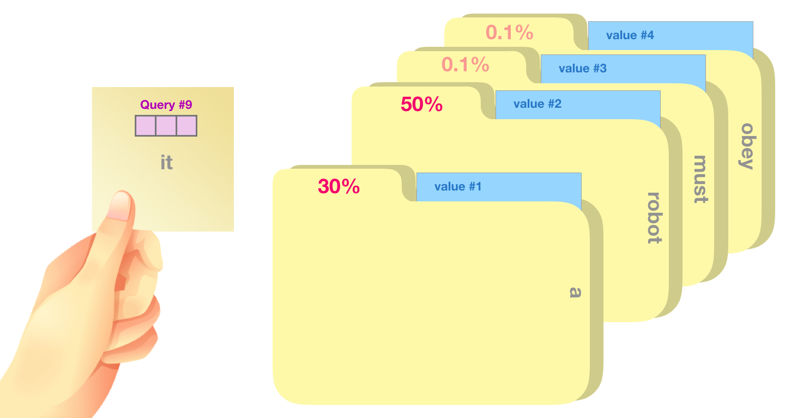

# ch05 · 注意力（Attention）

> 前序章节以 MLP（Transformer 的一个重要部件）为载体，探究了学习的本质，理解了神经网络及其通用训练技术。
> 
> M2 起步章，开始研究 Transformer 的另一个重要部件：注意力（Attention）。注意力是 Transformer 的心脏，也是 LLM 全部能力的源头。
> 
> 本章只讲注意力本身，不碰位置编码、残差、FFN（Feed-Forward Network，前馈网络）—— 那些留给 ch06 补全。

## 学习目标

1. 看到 `softmax(QK^T/√d_k)V` 这行公式时，每个符号都能讲清楚为什么
2. 能徒手写出缩放点积公式，解释 `√d_k` 不是装饰
3. 能区分 padding mask 与 causal mask，知道掩码在 softmax 哪一步生效
4. 理解多头注意力是"拆维度 → 并行算 → concat → 投影"，不是"复制 H 份算 H 遍"

## 前置依赖

- ch02 §3 矩阵乘法 + §4 softmax、ch03 §3 `nn.Module` 写法

---

## 1. 从序列建模说起

### 1.1 序列任务：MLP 不够用了

前面 ch02–ch04 我们一直在做**分类**：输入一张图、一组数值特征，输出一个类别。MLP 在这类任务上工作得很好，但它有两个隐含前提：

- **输入维度固定**（28×28 的图、d 维特征向量……）
- **输入元素的角色靠"位置约定"绑定**（第 1 维永远是某个特征、第 2 维永远是另一个特征——MLP 靠"哪一维放哪个特征"的固定槽位约定来区分各维语义）

但现实里有一大类任务不满足这两个前提——**序列任务**：

- **机器翻译**：`"I love NLP"` → `"我爱自然语言处理"`
- **语言建模**（LLM 的核心任务）：根据前文预测下一个词
- **文本摘要、情感分析、对话**……

序列任务的特殊性体现在：

1. **变长**：句子可长可短，MLP 要求固定输入维度，硬编码一个最大长度既浪费又僵硬
2. **顺序本身是信息，且语义角色不绑定固定位置**：`"猫追狗"` vs `"狗追猫"` 用词集合一样、含义却相反；`"今天天气真好"` 和 `"真好，今天天气"` 同样意思、主语却在不同位置。MLP 那种 "第 i 维 = 第 i 个固定槽" 的设计没法优雅处理 "同一语义角色出现在任意位置" 的情况，除非每种排列都被训练见过
3. **长程依赖**：`"我在巴黎长大，所以我会说____"` ——空格处的答案依赖句首的"巴黎"，相隔多个词

要处理这类任务，得有一种能**按顺序吃词、能记住历史**的网络结构。这就是 RNN 登场的舞台。

### 1.2 RNN：第一个解法

**RNN（Recurrent Neural Network，循环神经网络）** 的核心思想：维护一个**隐状态** $h_t$，每读一个词就更新一次：

\[
h_t = f(x_t, h_{t-1})
\]


$x_t$ 是第 $t$ 个词的输入向量，$h_{t-1}$ 是上一时刻的隐状态，$f$ 通常是 "Linear + tanh" 之类的小网络

```
x_1 ──→ h_1 ──→ h_2 ──→ h_3 ──→ ... ──→ h_n
        ↑       ↑       ↑               ↑
        x_1     x_2     x_3             x_n
                                        ↑
                          h_n 被认为"压缩"了整个句子的信息
```

经典翻译架构 **seq2seq（sequence-to-sequence）** 就用两个 RNN 串起来：

```
输入: I love NLP
       ↓ Encoder RNN 一步步吃
       ↓
       最后一个 hidden state h_n  ← 整句压成一个固定向量
       ↓
       Decoder RNN 据此生成: 我 爱 自然 语言 处理
```

RNN 解决了变长 + 顺序 + 一定程度的长程依赖，但它有三个**致命痛点**：

- **信息瓶颈**：整句信息要被压进一个固定向量 $h_n$（想象把一本 100 页的书只用一句话转述给别人）。句子越长，前面的词被稀释得越厉害
- **顺序依赖**：必须 $t-1$ 算完才能算 $t$，**没法并行**，算力用不起来
- **长程衰减**：第 50 步要让梯度传回第 1 步得经过 49 次链式法则，梯度消失/爆炸两难（LSTM/GRU 缓解但没根治）

> 本课程不深入 RNN 细节（不是 LLM 主线），以上信息足够理解 RNN/seq2seq 的局限性了。

### 1.3 Attention：从补丁到主角

Bahdanau 2014 提出 attention 时，它只是 RNN 的一个**补丁**：与其让 Decoder 只依赖一个压缩向量 $h_n$，不如让它在生成每个目标词时**回看**所有 Encoder 输出，按需取用，绕开了 "信息瓶颈"。

RNN + attention：保留 RNN 主干，attention 只是辅助

Vaswani 2017《Attention is All You Need》 走得更激进：既然 attention 这么好用，能不能**把 RNN 砍掉，只留 attention**？答案是能，这就是 **Transformer** 的诞生，也是现代 LLM 的起点。

砍掉 RNN 后，三个痛点同时解决：

- 信息瓶颈：每个位置都能直接回看所有位置，没有压缩
- 顺序依赖：所有位置**并行**计算，算力可打满了
- 长程衰减：任意两个词之间距离都是 1（一次 attention 就够），不再是 49 步链

> 代价是引入了 $O(n^2)$ 复杂度（每对词都要算一次），这是后续长上下文优化的主战场（§5 速记里会提）。

### 1.4 一句话直觉

> 注意力 = **可微分的字典查找**。

普通字典：给 key `"apple"` → 返回 value。

注意力：给一个 **query**，对所有 keys 算 "相似度权重"，把对应 values 加权求和返回。"相似度" 是连续的（点积+softmax），所以可微，能反传。


> 图片引自 The Illustrated GPT-2 @jalammar

看到这里的 "相似度权重"，是否能回忆起来 ch02 中点积的几何视角相关内容？可以去 ch02 1.2 回收一下之前对本节的铺垫了。

> 相似度是算子/数学层面的概念，如果你觉得相似度比较难理解，可以替换为**关联度/相关性**来记忆理解。

---

## 2. 缩放点积注意力

从这里开始，忘掉 RNN/seq2seq。

下面讲的是 Transformer 的 self-attention：**一个核心通用算子**，吃一个词嵌入向量序列，让序列里每个位置都看一眼其他所有位置，然后输出同长的上下文注意增强后的新向量序列。

从这里开始，为了更贴近学术理论与实践，我们将之前的**词**的说法先换为 **token** 表述，token 是文本被分词器切出的最小单元（可以是一个字、一个词或子词片段，ch08 详讲）。

### 2.1 Q/K/V 三元组

设输入序列 `X ∈ R^{n × d}`（n 个 token，每个 d 维），三个**独立**的可学习投影矩阵：

\[
Q = X W^Q, \quad K = X W^K, \quad V = X W^V
\]

形状：Q、K 是 `(n, d_k)`，V 是 `(n, d_v)`。对应投影矩阵 W^Q、W^K 为 `(d, d_k)`，W^V 为 `(d, d_v)`。工程上常令 `d_v = d_k` 简化。

| 角色 | 类比 | 说明 |
|---|---|---|
| Query (Q) | "我想找什么" | 每个 token 各有一个 query，代表它想关注谁 |
| Key (K) | "我是什么" | 每个 token 各有一个 key，供所有 query 算相似度 |
| Value (V) | "我能贡献什么" | 每个 token 各有一个 value，按权重被取用 |

在 self-attention 里 Q/K/V 都从**同一个 X** 投影出来——同一份输入，三种身份。

### 2.2 公式

\[
\mathrm{Attention}(Q, K, V) = \mathrm{softmax}\!\left(\frac{QK^\top}{\sqrt{d_k}}\right) V
\]

语义：每个 token 用自己的 query 去和所有 token 的 key 算相似度，得到权重，再用权重加权混合所有 token 的 value，结果是一个融合了上下文信息的新向量，供后续层进一步处理（ch06 详述完整架构）。

逐步拆：

1. `QK^T`：形状 `(n, n)`（n 为上方提到的输入 X 的 token 长度），第 `(i, j)` 项 = query_i 与 key_j 的点积，即 "i 关注 j 的程度"
2. `/√d_k`：缩放（d_k 为每个 key 向量的维度），下面 §2.3 详讲
3. `softmax(行)`：每行归一化成概率，每个 query 对所有 key 的注意力权重和为 1
4. `× V`：用权重加权求和 V，得到形状 `(n, d_v)` 的输出

> 回顾 ch02 1.3：点积衡量两个向量的方向接近程度。`QK^T` 的每一项正是这个意思：query_i 和 key_j 方向越近，"i 关注 j" 的原始分数越高。

### 2.3 为什么要 √d_k

直觉：d_k 越大，`QK^T` 数值越大 → softmax 越尖锐 → 梯度越接近 0（softmax 饱和区）。

数学：假设 q、k 各分量 i.i.d.（independent and identically distributed，独立同分布：各分量互相独立且服从同一分布）均值 0 方差 1，**且 q 与 k 相互独立**（投影矩阵随机初始化时近似成立），那么 `q·k = Σ q_i k_i` 的方差 = `d_k`。除以 `√d_k` 把方差拉回 1，softmax 输出分布不会过于尖锐，梯度健康。

> 工程结论：**忘了除 √d_k 会训不动**。这是注意力的 Kaiming 初始化级别的"事前防火"。

### 2.4 一个 4 token 的示例

```
n=4, d_k=2, d_v=d_k

Q <- XW^Q      K <- XW^K      V <- XW^V
[1.0  1.0]     [1.0  1.0]     [1.0  0.0]
[0.0  1.0]     [0.0  1.0]     [0.0  1.0]
[1.0  0.0]     [1.0  0.0]     [1.0  1.0]
[0.5  0.5]     [0.5  0.5]     [0.5  0.5]

Step 1: QK^T (4×4)，每项 = q_i · k_j
        j=0   j=1   j=2   j=3
i=0    [2.0   1.0   1.0   1.0]    ← q_0·k_0 = 1*1+1*1=2
i=1    [1.0   1.0   0.0   0.5]
i=2    [1.0   0.0   1.0   0.5]
i=3    [1.0   0.5   0.5   0.5]

Step 2: /√d_k = /√2 ≈ /1.41
i=0    [1.41  0.71  0.71  0.71]
i=1    [0.71  0.71  0.00  0.35]
i=2    [0.71  0.00  0.71  0.35]
i=3    [0.71  0.35  0.35  0.35]

Step 3: softmax（逐行归一化，以 token 0 为例，其余行同理；以下为近似值）
i=0    [0.40  0.20  0.20  0.20]    ← token 0 对自己关注最多
...

Step 4: output_0 = 加权求和 V （其余行 output_i 同理）
                 = 0.40*[1,0] + 0.20*[0,1] + 0.20*[1,1] + 0.20*[0.5,0.5]
                 = [0.40+0+0.20+0.10, 0+0.20+0.20+0.10]
                 = [0.70, 0.50]            ← token 0 的最终输出向量
        ...
```

### 自检

1. 把 `√d_k` 拿掉，d_k=64 时 softmax 输出大概会变成什么样？
2. self-attention 里 W^Q、W^K、W^V 三个矩阵能合并成一个吗？

<details markdown="1">
<summary>答案速查</summary>

1. logit 方差变成 64 而不是 1，softmax 接近 one-hot（一个值 ≈1 其余 ≈0），梯度几乎全是 0，训不动

2. 不能。三者的"语义角色"不同：Q 表达"想找谁"，K 表达"自己是谁"，V 表达"自己能贡献什么"。共享会强行让"是什么"和"能贡献什么"必须相同，表达力大幅下降。极少数 ALBERT 类工作做过 K=V 共享，效果有损

</details>

---

## 3. 掩码

注意力公式没说"哪些 token 不能看"。但实际场景有两种 token 不该被关注：一是 padding（补位用的占位符，不含信息）；二是未来 token（自回归训练时，看到未来等于作弊）。

掩码就是干这个的：在 softmax **之前**把不该看的位置加上 `-∞`，softmax 后这些位置权重变 0。

### 3.1 Padding mask

batch 里每个序列长度不一样，短的右边补 `<pad>`。pad token 不该被 attend。这里的 logits 即 §2.2 中 `QK^T / √d_k` 的结果（softmax 之前的原始分数）：

```
原始 logits (n=4):  [3.0  0.5  -1.0   2.0]
mask:               [ 1    1    0     0 ]   ← 1=真实token可看，0=pad不可看
应用 mask:          [3.0  0.5  -inf  -inf]
softmax:            [0.92 0.08  0     0 ]
```

实现技巧：用 `logits.masked_fill(mask == 0, float("-inf"))`。

### 3.2 Causal mask（因果掩码）

LLM 训练时**当前 token 只能看自己和之前**，不能偷看未来——否则就是开卷考试，学不到东西。做法：mask 矩阵的上三角为 0（不可看），应用后 logits 矩阵的上三角被填成 `-∞`，softmax 后这些位置权重归零：

```
n=4 的 causal mask（1 = 能看，0 = 不能）：
        j=0 j=1 j=2 j=3
i=0      1   0   0   0       ← 第 0 个 token 只能看自己
i=1      1   1   0   0       ← 第 1 个 token 看 0 和 1
i=2      1   1   1   0
i=3      1   1   1   1
```

PyTorch 一行：

```python
mask = torch.tril(torch.ones(n, n))               # 下三角全 1
logits = logits.masked_fill(mask == 0, float("-inf"))
```

> **关键点**：mask 在 `softmax` **之前**加，不是之后。之后再 mask 已经把概率分给未来了，破坏归一化。

### 3.3 两种 mask 同时存在

实战训练里两者通常**一起**应用：causal mask 防偷看 + padding mask 排除补位。实现上只需合并成一个 mask——某位置只要任一条件说 "不可看"，最终就不可看（实现方式：两个 Mask 矩阵相 AND / 加性 MASK 相加）。

### 自检

1. 为什么 mask 一定要在 softmax 之前加，不能之后？
2. 推理时（自回归生成）每生成一个新 token，causal mask 长什么样？

<details markdown="1">
<summary>答案速查</summary>

1. softmax 后概率已经分配给未来位置了，再置零会让该行概率和不为 1，破坏归一化语义。在 softmax 前加 `-∞`，`exp(-∞)=0`，未来位置自然不参与归一化

2. 推理一步步走，第 t 步只算第 t 行 attention，query 是当前 token、keys/values 是前 t 个 token——形状本来就是 `(1, t)`，**不需要显式 mask**。这就是 KV cache 能省一大笔算力的根本原因（ch07 详讲）

</details>

---

## 4. MHA

MHA，全称 Multi-Head Attention，中译：多头注意力。

### 4.1 动机

回顾 §2：单头注意力对每个 token 只算出**一组**权重（一行 softmax，和为 1）。这一组权重得分给它想关注的所有对象——可语言里同一个 token 常要**同时**满足好几种关系。

例句 "那只**猫**追着**它**的**尾巴**跑"，代词 "它" 在不同维度想看不同对象：

- 句法关系：盯谓语 "追"（谁在追）
- 共指关系：盯 "猫"（它 = 猫）
- 修饰关系：盯 "尾巴"（它的尾巴）

单头只有一组权重，这三个诉求**抢同一份配额**——给 "猫" 多了给 "追" 就少了，最后折中成一个妥协分布，哪种关系都学不纯。这就是 "单头只能学一种模式" 的含义。

**多头思想**：开 H 条并行通道，每个头一套独立权重，各管一种关系，互不抢配额。这就引出一个问题——多头是不是把单头复制 H 份？

### 4.2 不是"复制 H 份算 H 遍"

直觉上容易以为：H 个头 = H 套完整的 `d×d` 参数，各自在全 d 维上算一遍 attention。**错**，那样参数量直接翻 H 倍。

**真相**：参数量不变，把 d 维**拆**成 H 段，每段 `d_k = d / H` 维，每个头只在自己那段子空间里算：

```
输入 X: (B, n, d=512)
  |
  | W^Q (512 × 512)
  ↓ 
Q: (B, n, 512)
  |
  | reshape: (B, n, H=8, d_k=64) → transpose(1,2): (B, H=8, n, d_k=64)
  ↓ 
对 H 个头并行算 attention，每个头算出 (B, H, n, d_v=64)
  |
  | transpose + reshape 合头: (B, n, H × d_v = 512)
  | W^O (512 × 512) 输出投影   ← 合头后再融合一次，4.3 细说
  ↓ 
output: (B, n, 512)
```

**总参数量与单头同维相同**，只是把同一份 d 维表示分给多头分工。参数量没多花一分，**表达力却更强**：每个头在自己的 d_k 维子空间独立学一种注意力模式，互不打架。

> 为什么拆开不会破坏信息？因为 W^Q 本身就是学出来的——网络会自动学会把相关信息投影到同一个头的 64 维子空间里。拆头只是让每组子空间**独立做 softmax**，互不干扰。

### 4.3 公式

\[
\mathrm{MHA}(X) = \mathrm{Concat}(\mathrm{head}_1, \dots, \mathrm{head}_H) W^O
\]

\[
\mathrm{head}_i = \mathrm{Attention}(X W^Q_i, X W^K_i, X W^V_i)
\]

工程上不会真的搞 3H 个独立小矩阵，而是用 3 个大矩阵 `W^Q, W^K, W^V`（各 `d × d`）一次投影出来，再 reshape 切头。代码效率与可读性都高。

公式末尾的 `W^O`（`d × d`，输出投影）是第四个投影矩阵：`Concat` 只是把各头输出在维度上**硬拼**成 d 维，头与头之间没有任何信息交互；`W^O` 再做一次线性混合，给网络一个"自己决定怎么融合多头信息"的自由度。它和 W^Q/K/V 同级、同量级，是 MHA 的标配收尾（自检第 2 题再展开）。

```python
# 理论写法：3×H=24 个小矩阵，循环 H 次（慢，不实用）
q_heads = [x @ W_Q_list[i] for i in range(H)]   # 每个 (n, d_k)
k_heads = [x @ W_K_list[i] for i in range(H)]
v_heads = [x @ W_V_list[i] for i in range(H)]

# 工程写法：1 个大矩阵一次算完 + reshape 切头（快，实际都这么写）
Q = x @ W_Q                             # (B, n, d) → (B, n, d)
Q = Q.reshape(B, n, H, d_k).transpose(1, 2)  # → (B, H, n, d_k)
# K、V 同理
```

### 4.4 形状记忆口诀

batch=B、序列长 n、模型维 d、头数 H、每头维 d_k = d/H。竖着读，每两个形状之间夹的就是这一步在干什么：

```
张量              形状                  ↓ 这步操作（改了哪一维）
──────────────────────────────────────────────────────────
输入 X           (B, n, d)
                                       │ 三次 Linear(d→d) 投影出 Q/K/V
Q, K, V          (B, n, d)
                                       │ reshape+transpose：把 d 拆成 H×d_k
切头后           (B, H, n, d_k)
                                       │ 每个头并行算 QK^T/√d_k
注意力分数       (B, H, n, n)
                                       │ 逐行 softmax（形状不变，只归一化）
注意力权重       (B, H, n, n)
                                       │ 权重 × V
各头输出         (B, H, n, d_k)
                                       │ transpose+reshape：H×d_k 拼回 d
合头             (B, n, d)
                                       │ 过 W^O 融合多头
输出             (B, n, d)
```

两头形状对称（都是 `(B, n, d)`），中间在 H 维上"拆开 → 并行 → 拼回"。记住这条竖线，写 MHA 就是肌肉记忆。

### 自检

1. d=512、H=8 和 d=512、H=64 哪个参数量大？
2. 为什么 MHA 末尾还要一个 `W^O`？

<details markdown="1">
<summary>答案速查</summary>

1. 一样大。Q/K/V/O 四个矩阵各 d×d=512×512，与 H 无关。H 只决定"拆几段"，不影响参数总量

2. concat 出来的 (n, d) 各头之间是"硬拼"的，没有任何信息交互。`W^O` 让各头输出再做一次线性混合，给网络一个"决定怎么融合多头信息"的自由度

</details>

---

## 5. 复杂度速记

| 项 | 复杂度 | 说明 |
|---|---|---|
| 时间 | O(n² · d) | `QK^T` 是 n×n |
| 空间 | O(n²) | attention 矩阵存下来 |
| 参数 | O(d²) | 4 个 d×d 矩阵，与 n 无关 |

n² 是 Transformer 长上下文的核心瓶颈。后来的 FlashAttention / Linear Attention / 滑窗 等都在攻这个问题，M3 之后会零星提到，本课程主线不深入。

---

## 6. 练习

落到 `Playground/ch05-attention/`：

| 脚本 | 内容 |
|---|---|
| `01_attention_numpy.py` | 纯 NumPy 实现单头缩放点积，逐步打印 QK^T / softmax / 输出 |
| `02_attention_torch.py` | PyTorch 单头版，与 `F.scaled_dot_product_attention` 输出对齐 |
| `03_multihead.py` | 手写 `MultiHeadAttention` 模块，与 `nn.MultiheadAttention` 数值对齐 |
| `04_causal_mask.py` | 因果掩码可视化 + 用"未来 token 替换"实验验证不泄漏 |

跑法同 ch04，CPU 秒级。

## 思考题

1. 如果让 Q 与 K 共享同一个投影矩阵（即 `W^Q = W^K`），attention 的对称性会变成什么样？训练上会出什么问题？
2. 多头注意力的 H 选 8、16、32 各有什么权衡？d=768 时为什么 H=12 是 GPT-2 的选择？
3. n²·d 的复杂度里，n=2k 和 n=8k 时 attention 矩阵显存分别多少（fp16（16-bit floating point，半精度浮点），单头单 batch）？

## 参考资料

- **Vaswani et al., "Attention is All You Need"**：原论文，Transformer + MHA 的源头
- **Bahdanau et al., "Neural Machine Translation by Jointly Learning to Align and Translate"**：attention 的早期形态（RNN + 加性注意力）
- **The Annotated Transformer (Harvard NLP)**：逐行注释的 PyTorch 实现，最佳辅助读物
- **Jay Alammar, "The Illustrated Transformer"**：图示派经典
