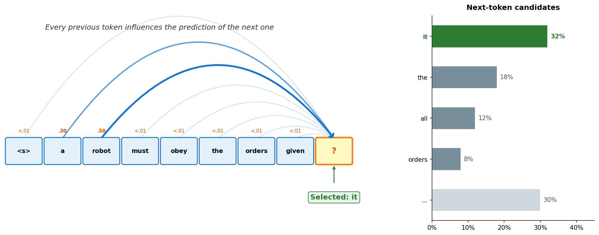

# ch07 · 生成策略与 KV cache

> ch06 训出来的 MiniGPT，其临时的自回归生成用的贪心解码下输出 "the the the the..."。本章解决两件事：
> 
> 1. **怎么解码** — 让生成的文本既不傻（贪心退化）也不乱（纯随机崩坏）
> 2. **怎么提速** — KV cache（Key/Value cache，键值缓存）让生成 n 个 token 的复杂度从 O(n³) 降到 O(n²)
>
> 本章是 M2 收官，也是 echo-mini 推理 CLI 的全部理论基础。

## 学习目标

1. 能解释 temperature / top-k / top-p 的数学定义与各自直觉
2. 能说明 KV cache 为什么有效、能省多少、形状如何变化
3. 知道训练阶段为什么用不上 KV cache，推理阶段为什么必须用

## 前置依赖

- ch06 全章（要给 ch06 的 MiniGPT 加策略和 cache）

---

## 1. 自回归生成

ch06 的 `forward` 输入一段 token 序列，输出每个位置的 logits。训练时用 logits 算 loss 就够了。但**推理时要用模型"写东西"**——怎么从 logits 变成一段文本？

做法叫**自回归生成（autoregressive generation）**：

```python
# 给定 prompt = [id_0, id_1, ..., id_k]
# 循环：
#   1. forward(prompt) → logits: (1, len, V)
#   2. 取最后一个位置的 logits[:, -1, :] → (1, V)
#   3. 从这个分布里 "选" 一个 token id（怎么选 = 解码策略）
#   4. 把选出的 id 拼到 prompt 末尾
#   5. 重复，直到满足停止条件（达到最大长度 / 生成了结束符）

# 简单演示
def generate(self, ids: torch.Tensor, max_new_tokens: int) -> torch.Tensor:
  """朴素贪心：每步取 argmax。ch07 会加 top-k / top-p / KV cache。"""
  self.eval()
  for _ in range(max_new_tokens):
      # 上下文超长就截断左侧（推理时无 KV cache 的简单做法）
      ids_cond = ids[:, -self.max_len :]
      logits = self(ids_cond)              # (B, n, V)
      next_logits = logits[:, -1, :]       # 只看最后一步：(B, V)
      next_id = SomeDecodeStratagy()       # 占位：解码策略，本章聚焦
      ids = torch.cat([ids, next_id], dim=1)
```

关键特征：**每步只生成一个 token，且依赖前面所有已生成的 token**——所以叫"自回归"（用自己的输出作为下一步输入）。



> 图中弧线表示"? 位置对每个已有 token 的关注度"。`a`(.30) 和 `robot`(.50) 贡献最大，其余 token 关注度 <.01。右侧条形图为模型输出的下一词概率分布，最终采样选中 `it`。
> 
> 学完本章后续的内容再来看这张图，便会感觉一目了然了。

对于伪代码中提到的解码策略，最朴素的"选法"是**贪心（greedy）**：每步取 argmax，选概率最高的那个 token。ch06 的练习用的就是这个。但贪心有严重问题（ch06 的练习陷入输出 the 的循环），下文将展开。

---

## 2. 为什么贪心不够

ch06 04 练习代码训完的 MiniGPT 续写 ROMEO 的结果：

```
ROMEO:
The the the the the the the the the the the the the the the the...
```

诊断：**贪心解码每步取 argmax**。小模型欠训练时，高频词（如 "the"）的 logit 在各种上下文下都偏高——贪心每步都选它，输出反馈为输入后进一步强化，陷入**确定性循环**。

数学上：贪心每步把概率分布退化为 one-hot（只有 argmax 位置为 1，其余为 0），永远走概率最高的那条路 → 没有任何探索 → 一旦进入循环态出不来。

解药：**给概率分布加一点不确定性**，让模型有机会跳出局部最优。三种主流做法：temperature、top-k、top-p。

> Beam search 是另一类（保留多条路径取总概率最高的），在机器翻译时代曾是主流，**LLM 时代基本不用** — beam 倾向短而保守的输出，对开放式生成（写故事、对话）反而不利。本章不展开。

---

## 3. Temperature：拉伸或压缩 softmax

$$
\text{softmax}_T(\mathbf{z})_i = \frac{\exp(z_i / T)}{\sum_j \exp(z_j / T)}
$$

| T | 效果 | 直觉 |
|---|---|---|
| T → 0⁺ | softmax 趋于 one-hot | 等价贪心，最确定 |
| T ≈ 0.7–0.8 | 挤压使分布略尖锐，多样性可控 | 对话/续写常用，兼顾质量与变化 |
| T = 1 | 原始 softmax | 模型学到的原始分布 |
| T → ∞ | >1 拉伸使分布变缓，∞ 时趋于均匀 | 完全随机 |

**数字示例** — logits = [2.0, 1.0, 0.5]（3 个候选 token）：

| | token A | token B | token C |
|---|---|---|---|
| T = 1（原始） | 0.59 | 0.22 | 0.13 |
| T = 0.8 | 0.67 | 0.20 | 0.10 |
| 贪心 (T → 0) | 1.00 | 0.00 | 0.00 |

T=0.8 使头部概率更集中（0.59→0.67），尾部被压缩，但仍保留采样多样性；贪心则退化为 argmax。

> 注意：采样是**按概率随机抽取**，不是取最大值。0.67 意味着每步仍有 33% 概率选到其它 token，多步累积即可打破贪心的重复循环。

工程经验：

- T ∈ [0.7, 1.0]：对话/续写默认范围
- T = 0：需要确定性输出（代码补全、抽取式 QA（Question Answering，问答））
- T > 1.5：极少用，输出失控

实现一行：`logits = logits / T` 然后接 softmax 与采样。

### 自检

1. T=0.5 与 T=2.0 哪个分布更"尖"？
2. 为什么 T 不能等于 0？

<details markdown="1">
<summary>答案速查</summary>

1. T=0.5。`exp(z/0.5)` 比 `exp(z)` 把高 logit 的优势进一步放大 → 分布更尖

2. 数值上除零会爆炸。等价行为应该走 argmax 路径，不要走 softmax。代码里通常 `if T == 0: return argmax` 早退

</details>

---

## 4. Top-k 采样

> 只在概率最高的 k 个 token 里采样，其余直接丢弃。

```
1. 对 logits 取 topk → 得到 k 个 logit 与索引
2. 把其余位置 logit 置为 -inf
3. softmax + multinomial 采样 1 个
```

> multinomial - 带权重（每项概率）的随机抽取

直觉：**截掉长尾**。模型分布尾部往往是大量"明显不该出现"的 token，加起来概率不小但都是噪声。砍掉后采样更安全。

经验值：k ∈ [20, 100]。k=1 等价贪心，k=V（词表大小）等价无截断。

```python
def top_k_filter(logits: torch.Tensor, k: int) -> torch.Tensor:
    # logits: (B, V)；返回同形状，非 top-k 位置为 -inf
    v, _ = torch.topk(logits, k)
    threshold = v[:, -1:]                                # 第 k 大的值
    return torch.where(logits < threshold, float("-inf"), logits)
```

---

## 5. Top-p (nucleus) 采样

> 选择**累计概率 ≥ p 的最小 token 集合**，在集合内重新归一化采样。

```
1. logits → softmax → 概率
2. 按概率降序排
3. 从最高概率开始累加，一旦累计概率 ≥ p，**保留已累加的所有 token**（构成 nucleus），截掉剩余
4. 重新归一化
5. multinomial 采样 1 个
```

直觉：**自适应 k**。

- 模型很确定时（如填"今天天气真"后接什么），分布尖锐，p=0.9 可能只保留 3-5 个 token
- 模型不确定时（如开放性创意），分布扁平，p=0.9 可能保留几十上百个

top-k 是"硬截断"，top-p 是"软截断"。经验值：p ∈ [0.8, 0.95]。

```python
def top_p_filter(logits: torch.Tensor, p: float) -> torch.Tensor:
    # logits: (B, V)；返回同形状，nucleus 外的位置为 -inf
    sorted_logits, sorted_idx = torch.sort(logits, descending=True)
    cum_probs = torch.cumsum(F.softmax(sorted_logits, dim=-1), dim=-1)
    # 累计概率超过 p 的位置标记为移除（保留第一个超过 p 的 token）
    remove_mask = cum_probs - F.softmax(sorted_logits, dim=-1) >= p
    sorted_logits[remove_mask] = float("-inf")
    # 还原原始顺序
    return sorted_logits.scatter(1, sorted_idx, sorted_logits)
```

### 自检

1. top-p=1.0 等价于什么？top-k=<词表长度>呢？
2. 如果只能用 top-k 或 top-p 其中一种，为什么 top-p 更受青睐？

<details markdown="1">
<summary>答案速查</summary>

1. 都等价于"无截断的纯采样"，整个词表都参与归一化采样

2. top-k 的 k 是固定的，无法适配分布形状。模型很确定时 k=50 可能让尾部噪声混入；模型不确定时 k=50 又可能截太狠。top-p 按概率累计自适应，分布尖时候选少、分布平时候选多——所以二选一时 top-p 更通用。实践中二者常搭配：top-k 当安全网粗筛，top-p 做精细截断

</details>

---

## 6. 解码的配方

上面介绍完了 temperature / top-k / top-p 几种解码时的采样算法，需要强调的是这几种方法不是对立冲突的。

如 GPT-2/LLaMA 等的常见配方是 **top-k=50 & top-p=0.95 & T=0.8** 三件套，先 top-k 砍掉离谱长尾、再 top-p 自适应、最后 Temperature 调锐度。

回到 ch06 的 "the the the" 问题。三种解药：

| 配方 | 效果 | 适用 |
|---|---|---|
| `greedy` | 死循环依旧 | 仅诊断 |
| `T=0.8` | 偶尔跳出循环 | 最小修补 |
| `T=0.8 & top-k=20 & top-p=0.9` | 几乎不死循环 | 推荐默认 |

ch07 §07 练习 1 会跑出对照打印。

> **另一类正交手段：repetition / frequency penalty**。直接对"已生成过的 token"的 logit 减一个惩罚值（OpenAI API 的 `presence_penalty` / `frequency_penalty`），从源头打压重复，可与上面三件套叠加。本章不展开实现。

---

## 7. KV cache

### 7.1 朴素自回归生成的浪费

ch06 §03 的 `generate` 每生成一个新 token，**整段历史重新跑一遍**：

```python
# ch06 03_model.py — MiniGPT.generate（关键行）
for _ in range(max_new_tokens):
    ids_cond = ids[:, -self.max_len:]
    # 每步把整段 ids 历史重新 forward，前 t-1 个 token 的 K/V 白算
    # self 调用: forward([id_0, id_1, ..., id_{t-1}])
    logits = self(ids_cond)
    next_id = logits[:, -1, :].argmax(dim=-1, keepdim=True)
    # id_t append 到 id_{t-1} 后
    ids = torch.cat([ids, next_id], dim=1)
```

attention 的 K/V 只依赖各自位置的输入 token——**之前算过的 K/V 永远不会变**。每步重算就是纯浪费。

### 7.2 KV cache 怎么省

```
第 1 步：forward([id_0])      → 算出 K_0, V_0，存入 cache
第 2 步：forward([id_1])      → 只算 K_1, V_1，cache 拼接 → [K_0,K_1], [V_0,V_1]
                              → query 只是 q_1（单个 token）
                              → attention(q_1, [K_0,K_1], [V_0,V_1]) → logits
第 t 步：forward([id_{t-1}])  → 只算 K_{t-1}, V_{t-1}，append 到 cache
                              → attention(q_{t-1}, K_cache, V_cache)
```

每步：

- 输入需增量计算的只有**上一步采样命中的那个 token**
- Q 只算 1 个，K/V 只新增 1 个，与历史 K/V cache 拼起来算 attention
- attention 矩阵形状从 `(t, t)` 退化成 `(1, t)`——query 只有最末位一个，天然只能看到自己和之前，**无需显式 causal mask 即满足因果性**

### 7.3 复杂度对比

设生成完成后总序列长 n（含 prompt），模型维 d，层数 L。

| 阶段 | 无 cache | 有 cache |
|---|---|---|
| 第 t 步 forward | O(t² · d · L) | O(t · d · L) |
| 生成 n 个 token 总计 | O(n³ · d · L) | O(n² · d · L) |
| 显存 | 仅 weights | weights + KV cache (O(L · n · d)) |

总计复杂度的来源：把每步代价对 t=1..n 求和。无 cache 是 Σt² ≈ n³/3 → O(n³)；有 cache 是 Σt ≈ n²/2 → O(n²)。

**结论**：KV cache 用显存换计算，n 越大省得越多。生成 1k token，无 cache 算 ~10⁹ 次，有 cache ~10⁶ 次，**1000 倍**差距。

### 7.4 形状变化（必背）

KV cache 推理分两阶段：

1. **Prefill**：把 prompt 整段一次性 forward，填充 KV cache（等价于无 cache 的 forward）
2. **Decode**：逐 token 生成，每步只算新 token 的 Q/K/V，与 cache 拼接做 attention

|  | Prefill（首次填充 cache） | Decode（第 t 步） |
|---|---|---|
| 输入 ids | (B, n) | (B, 1) |
| Q | (B, H, n, d_k) | (B, H, 1, d_k) |
| K cache | — | (B, H, t, d_k) |
| V cache | — | (B, H, t, d_k) |
| attention 矩阵 | (B, H, n, n) | (B, H, 1, t) |
| 输出 | (B, n, d) | (B, 1, d) |

> 表中符号：B = batch size，H = 注意力头数，n = prompt 长度，d_k = 每头维度（d / H），t = 当前已有序列长度（含 prompt + 已生成）。

### 7.5 边界

- **训练用不上**：训练时一次性给全长序列，并行算所有位置的 loss，没有"上一步"概念
- **首次 prefill 走"无 cache"路径**：把 prompt 一次性 forward 进去同时填充 cache，之后才进入"每步推得下一 token"
- **batch 内序列不等长**：KV cache 的 seq_len 维必须对齐，短序列需 left-padding 补齐左侧，attention 时 mask 掉 pad 位置的 K/V。为什么是 left-padding？——右侧是"生成区"，所有序列的末位必须对齐到同一列，新 token 才能统一拼接。（对比：训练时无 KV cache，通常右 padding + loss mask 忽略 pad，与此处无关）

### 自检

1. 为什么 KV cache 不需要存 Q？
2. 推理时第 t 步的 attention 矩阵是 (1, t) 而不是 (t, t)，那 causal mask 哪去了？

<details markdown="1">
<summary>答案速查</summary>

1. Q 是当前要查询的 token（query），每步只用一次就丢，不会复用。K 和 V 是被查询的对象，所有未来步都会反复看到 → 缓存它们才有意义

2. 当 query 只有 1 个（最末位的 token），它本来就只能看自己和之前——形状 (1, t) 自动满足因果性，无需显式 mask。这也是 KV cache 实现起来不麻烦的根本原因

</details>

---

## 8. 练习

落到 `Playground/ch07-generation/`：

| 脚本 | 内容 |
|---|---|
| `01_decoding_compare.py` | 即时训练 200 步小 MiniGPT，对比 greedy / T=0.8 / top-k / top-p / 三件套 五种续写 |
| `02_kv_cache.py` | 给 ch06 的 `CausalSelfAttention` 加 KV cache，①验证数值一致 ②实测加速 |

跑法同 ch06。01 ~10s，02 几秒。

## 思考题

1. 为什么 LLM 时代 beam search 失宠？
2. KV cache 的显存占用 = `2 · L · B · n · d · sizeof(dtype)`。LLaMA-7B（L=32, d=4096）batch=1、n=4096、fp16，cache 多大？这是为什么长上下文 LLM 推理特别吃显存的根本原因
3. 假设你要做 **batch 推理**，batch 内 prompt 长度不一，KV cache 怎么管理？（提示：padding / left-padding / continuous batching）

## 参考资料

- **Holtzman et al., "The Curious Case of Neural Text Degeneration"**：top-p (nucleus) 采样原论文，附"为什么贪心/beam 在开放式生成会退化"的精彩分析
- **Pope et al., "Efficiently Scaling Transformer Inference"**：KV cache 与 batch 推理优化的工程参考
- **vLLM PagedAttention 论文**：把 KV cache 当虚拟内存管理，是当前推理引擎的主流方案
- **Karpathy, "nanoGPT" generate.py**：极简 KV cache 参考实现
