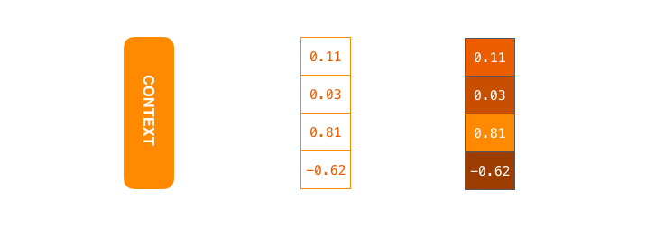
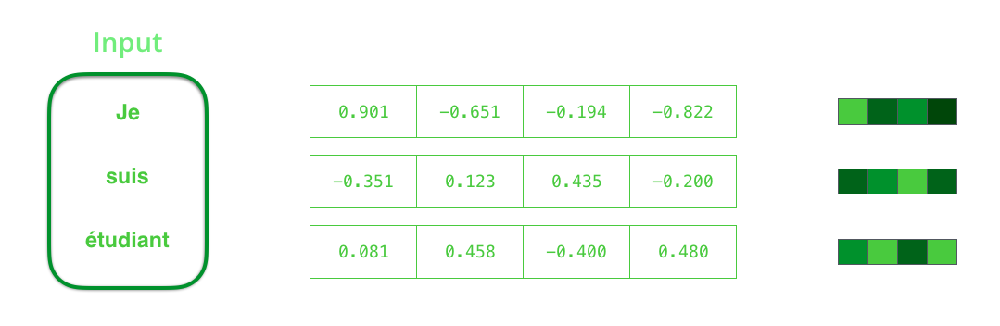
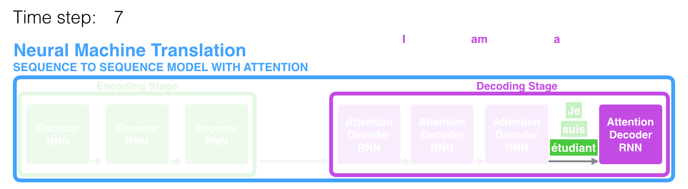
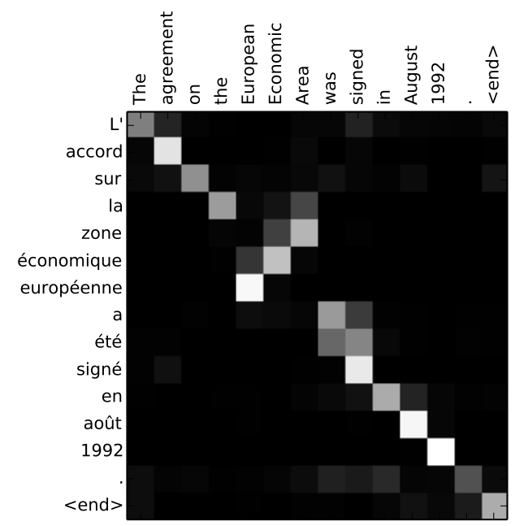

# 翻译中的 Seq2seq & Attention

原文：[Visualizing A Neural Machine Translation Model (Mechanics of Seq2seq Models With Attention)](https://jalammar.github.io/visualizing-neural-machine-translation-mechanics-of-seq2seq-models-with-attention/)

序列到序列（Sequence-to-sequence）模型是一类深度学习模型，在机器翻译、文本摘要和图像描述等任务上取得了很大的成功。Google 翻译在 2016 年底开始在生产环境中[使用](https://blog.google/products/translate/found-translation-more-accurate-fluent-sentences-google-translate/)这样的模型。这些模型在两篇开创性论文（[Sutskever et al., 2014](https://papers.nips.cc/paper/5346-sequence-to-sequence-learning-with-neural-networks.pdf)、[Cho et al., 2014](http://emnlp2014.org/papers/pdf/EMNLP2014179.pdf)）中得到了阐释。

然而我发现，要把这个模型理解到足以实现它的程度，需要层层拆解一系列彼此叠加的概念。我想，如果能把这些想法中的一部分用可视化的方式表达出来，会更容易理解。这正是我在本文中想做的事。要读懂本文，你需要一些深度学习的基础知识。我希望它能成为阅读上面提到的论文（以及文中后面链接的注意力论文）的一个有用的辅助。

序列到序列模型是这样一种模型：它接收一个项的序列（单词、字母、图像的特征……等等），并输出另一个项的序列。一个训练好的模型会这样工作：
<video width="100%" height="auto" loop autoplay controls>
  <source src="../images/seq2seq/seq2seq_1.mp4" type="video/mp4">
  Your browser does not support the video tag.
</video>

<!--more-->

 

在神经机器翻译中，一个序列就是一连串单词，被逐个处理。输出同样是一连串单词：

<video width="100%" height="auto" loop autoplay controls>
  <source src="../images/seq2seq/seq2seq_2.mp4" type="video/mp4">
  Your browser does not support the video tag.
</video>

### 深入幕后

在底层，这个模型由一个 encoder（编码器）和一个 decoder（解码器）组成。

encoder 处理输入序列中的每个项，把它捕捉到的信息编译进一个向量（称为 context，上下文）。处理完整个输入序列后，encoder 把 context 发送给 decoder，后者开始逐项地产生输出序列。

<video width="100%" height="auto" loop autoplay  controls>
  <source src="../images/seq2seq/seq2seq_3.mp4" type="video/mp4">
  Your browser does not support the video tag.
</video>

 

机器翻译的情形也是如此。

<video width="100%" height="auto" loop autoplay controls>
  <source src="../images/seq2seq/seq2seq_4.mp4" type="video/mp4">
  Your browser does not support the video tag.
</video>

在机器翻译的情形下，context 是一个向量（基本上就是一组数字）。encoder 和 decoder 往往都是循环神经网络（RNN）（一定要去看看 Luis Serrano 的 [A friendly introduction to Recurrent Neural Networks](https://www.youtube.com/watch?v=UNmqTiOnRfg)，作为 RNN 的入门介绍）。

    
    context 是一个浮点数向量。在本文后面，我们会通过给数值较高的单元格赋予更明亮的颜色，来用颜色把向量可视化。

你可以在搭建模型时设置 context 向量的大小。它基本上就是 encoder RNN 中隐藏单元（hidden units）的数量。这些可视化展示的是一个大小为 4 的向量，但在真实世界的应用中，context 向量的大小会是诸如 256、512 或 1024 这样的值。

 

按照设计，RNN 在每个时间步接收两个输入：一个输入（在编码器的情形下，是输入句子中的一个单词）和一个隐藏状态（hidden state）。然而，单词需要用一个向量来表示。为了把一个单词转换成向量，我们求助于一类称为"[词嵌入（word embedding）](https://machinelearningmastery.com/what-are-word-embeddings/)"算法的方法。这些算法把单词转换到能够捕捉单词大量含义／语义信息的向量空间中（例如 [king - man + woman = queen](http://p.migdal.pl/2017/01/06/king-man-woman-queen-why.html)）。

 

    
    我们需要在处理输入单词之前先把它们转换成向量。这个转换是用一个<a href="https://en.wikipedia.org/wiki/Word_embedding">词嵌入（word embedding）</a>算法完成的。我们可以使用<a href="http://ahogrammer.com/2017/01/20/the-list-of-pretrained-word-embeddings/">预训练的嵌入</a>，也可以在我们自己的数据集上训练我们自己的嵌入。大小为 200 或 300 的嵌入向量是典型的，为了简洁，我们这里展示的是一个大小为 4 的向量。

现在我们已经介绍了主要的向量／张量，让我们回顾一下 RNN 的运作机制，并建立一套描述这些模型的可视化语言：

<video width="100%" height="auto" loop autoplay controls>
  <source src="../images/seq2seq/RNN_1.mp4" type="video/mp4">
  Your browser does not support the video tag.
</video>

 

下一个 RNN 步骤接收第二个输入向量和隐藏状态 #1，来产生该时间步的输出。在本文后面，我们会用一个类似这样的动画来描述神经机器翻译模型内部的各个向量。

 

在接下来的可视化中，encoder 或 decoder 的每一次脉动，都是那个 RNN 在处理它的输入并为该时间步生成一个输出。由于 encoder 和 decoder 都是 RNN，每当其中一个 RNN 进行一次处理时，它都会根据它的输入以及它之前见过的输入来更新自己的 hidden state（隐藏状态）。

让我们来看看 encoder 的 hidden states。注意，最后一个 hidden state 实际上就是我们传递给 decoder 的那个 context。

<video width="100%" height="auto" loop autoplay controls>
  <source src="../images/seq2seq/seq2seq_5.mp4" type="video/mp4">
  Your browser does not support the video tag.
</video>

 

decoder 也维护着一个 hidden state，并把它从一个时间步传递到下一个时间步。我们只是在这张图里没有把它可视化出来，因为眼下我们关注的是模型的主要部分。

现在让我们来看另一种把序列到序列模型可视化的方式。这个动画会让你更容易理解那些描述这类模型的静态图。这被称为"展开（unrolled）"视图——我们不再只展示一个 decoder，而是为每个时间步展示它的一个副本。这样我们就能看到每个时间步的输入和输出。

<video width="100%" height="auto" loop autoplay controls>
  <source src="../images/seq2seq/seq2seq_6.mp4" type="video/mp4">
  Your browser does not support the video tag.
</video>

 

## 现在让我们来关注注意力
事实证明，context 向量成了这类模型的一个瓶颈。它使得这些模型很难处理长句子。[Bahdanau et al., 2014](https://arxiv.org/abs/1409.0473) 和 [Luong et al., 2015](https://arxiv.org/abs/1508.04025) 提出了一个解决方案。这些论文引入并完善了一种称为"注意力（Attention）"的技术，它极大地提升了机器翻译系统的质量。注意力让模型能够根据需要聚焦于输入序列中相关的部分。

    在时间步 7，注意力机制让 decoder 能够在生成英文翻译之前先聚焦于单词 "étudiant"（法语中的 "student"）。这种放大输入序列中相关部分信号的能力，使得注意力模型比没有注意力的模型产生更好的结果。

 

让我们继续在这个高度抽象的层面上看注意力模型。注意力模型与经典的序列到序列模型主要有两点不同：

第一，encoder 向 decoder 传递多得多的数据。encoder 不再只传递编码阶段最后一个隐藏状态，而是把_所有_的 hidden states 都传递给 decoder：

<video width="100%" height="auto" loop autoplay controls>
  <source src="../images/seq2seq/seq2seq_7.mp4" type="video/mp4">
  Your browser does not support the video tag.
</video>

 

第二，注意力 decoder 在产生输出之前会多做一步。为了聚焦于输入中与当前解码时间步相关的部分，decoder 会做以下的事：

 1. 查看它收到的那组编码器 hidden states——每个 encoder hidden state 都与输入句子中的某个特定单词关联最紧密
 1. 给每个 hidden state 打一个分（我们暂且不管打分是怎么做的）
 1. 把每个 hidden state 乘以它经过 softmax 处理后的分数，从而放大分数高的 hidden states，淹没分数低的 hidden states

<video width="100%" height="auto" loop autoplay controls>
   <source src="../images/seq2seq/attention_process.mp4" type="video/mp4">
   Your browser does not support the video tag.
</video>

 
 

这个打分的过程在 decoder 一侧的每个时间步都会进行。

现在让我们在下面的可视化中把整个过程整合起来，看看注意力的处理过程是如何运作的：

1. 注意力解码器 RNN 接收 \<END\> 标记的嵌入，以及一个初始的解码器隐藏状态。
1. 这个 RNN 处理它的输入，产生一个输出和一个新的隐藏状态向量（h4）。这个输出被丢弃。
1. 注意力步骤：我们用编码器隐藏状态和 h4 向量来为这个时间步计算一个上下文向量（C4）。
1. 我们把 h4 和 C4 拼接（concatenate）成一个向量。
1. 我们把这个向量传入一个前馈神经网络（feedforward neural network）（它是和模型联合训练的）。
1. 这个前馈神经网络的输出指示了这个时间步的输出单词。
1. 在接下来的时间步重复这个过程

<video width="100%" height="auto" loop autoplay controls>
   <source src="../images/seq2seq/attention_tensor_dance.mp4" type="video/mp4">
   Your browser does not support the video tag.
</video>

 
 

这是另一种观察我们在每个解码步骤中正聚焦于输入句子哪个部分的方式：

<video width="100%" height="auto" loop autoplay controls>
  <source src="../images/seq2seq/seq2seq_9.mp4" type="video/mp4">
  Your browser does not support the video tag.
</video>

注意，这个模型并不是机械地把输出的第一个单词与输入的第一个单词对齐。它实际上在训练阶段就学会了如何在那一对语言（在我们的例子中是法语和英语）之间对齐单词。上面列出的注意力论文给出了一个例子，展示了这个机制可以有多精确：

    你可以看到，模型在输出 "European Economic Area" 时是如何正确地分配注意力的。在法语中，这几个单词的顺序与英语相比是反过来的（"européenne économique zone"）。句子中其他每个单词的顺序都是相似的。

 

如果你觉得自己准备好学习它的实现了，一定要去看看 TensorFlow 的 [Neural Machine Translation (seq2seq) Tutorial](https://github.com/tensorflow/nmt)。

---

 

我希望你觉得这篇文章有用。这些视觉材料是一节关于注意力的课程的早期迭代版本，该课程是 Udacity [Natural Language Processing Nanodegree Program](https://www.udacity.com/course/natural-language-processing-nanodegree--nd892) 的一部分。我们在课程中会讲得更详细，包括讨论各种应用，以及触及更近期的注意力方法，比如来自 [Attention Is All You Need](https://arxiv.org/abs/1706.03762) 的 Transformer 模型。

