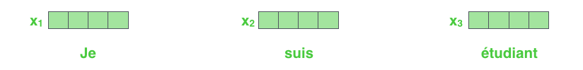
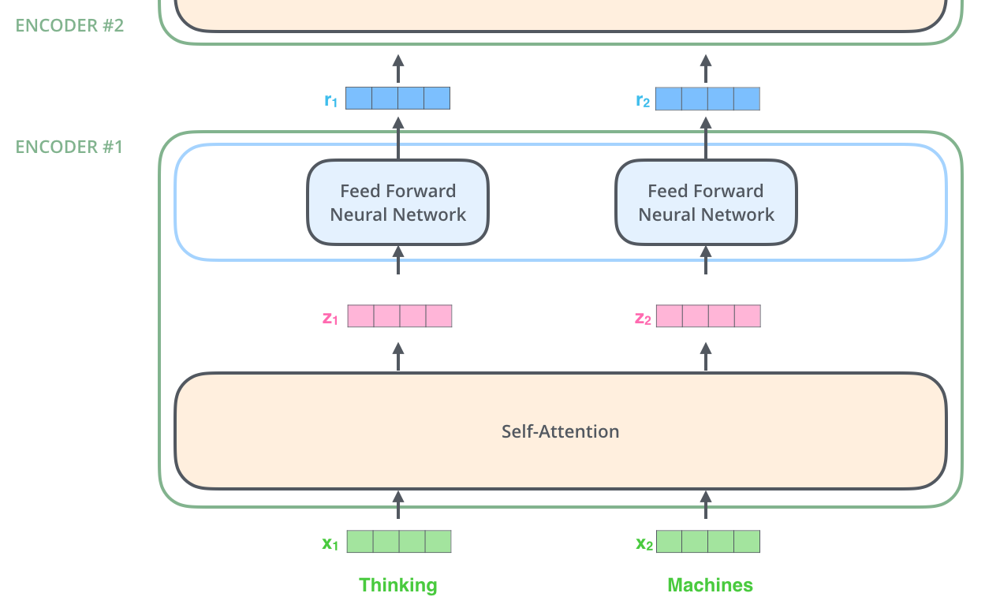
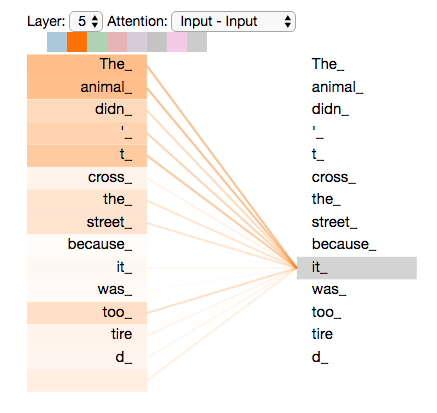
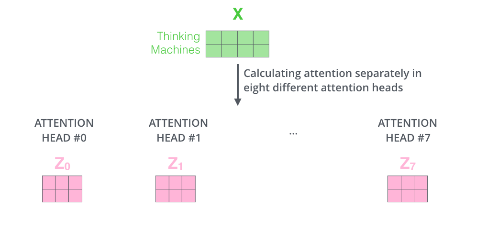
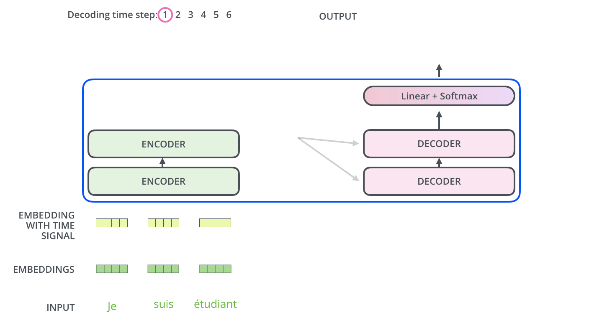
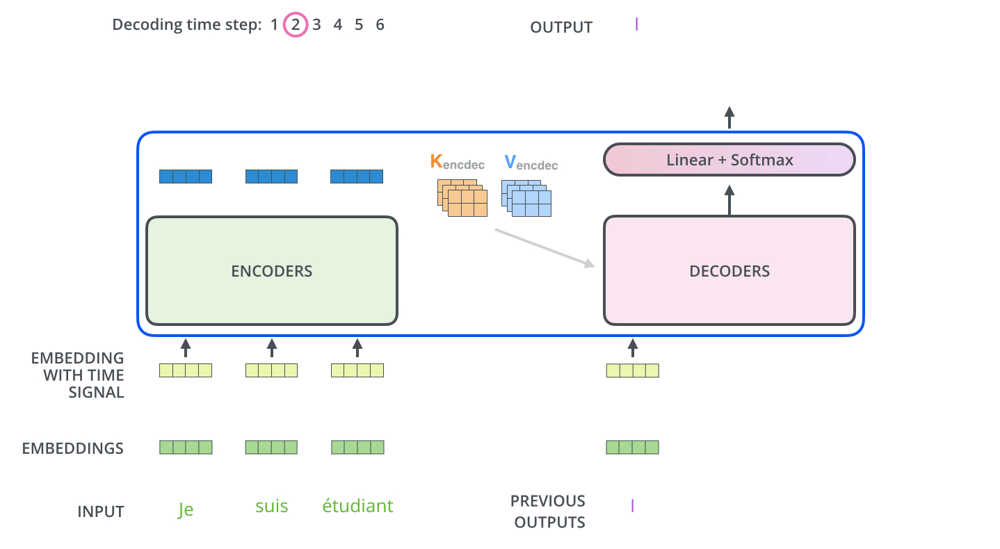
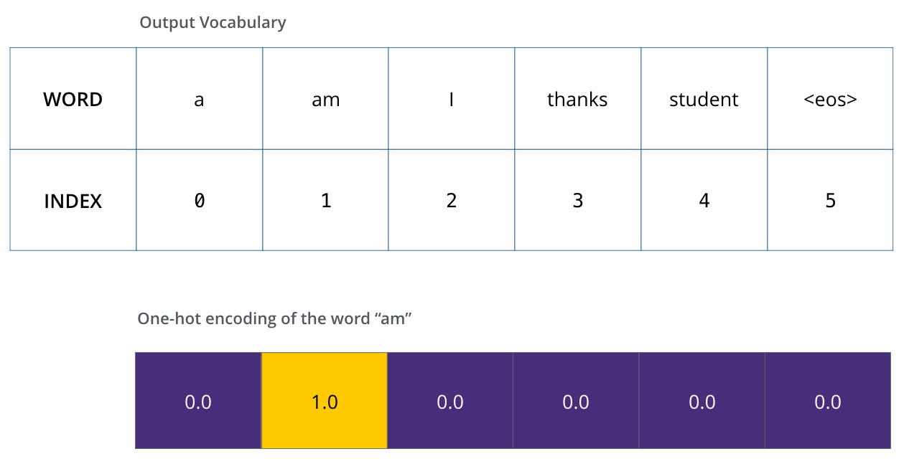
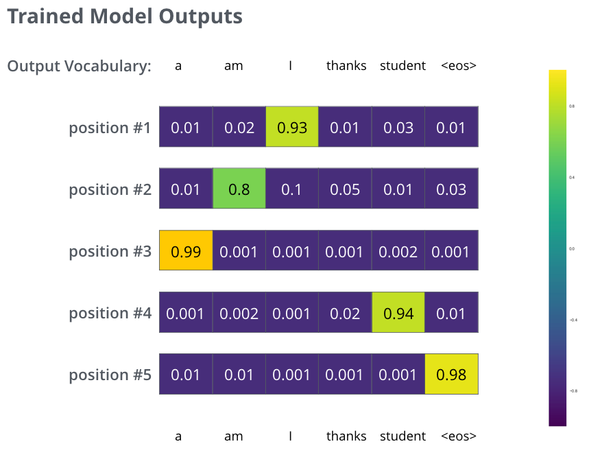

# 图解 Transformer

原文：[The Illustrated Transformer](https://jalammar.github.io/illustrated-transformer/)

---

在[上一篇文章中，我们介绍了 Attention](https://jalammar.github.io/visualizing-neural-machine-translation-mechanics-of-seq2seq-models-with-attention/)——一种在现代深度学习模型中无处不在的方法。Attention 是一个帮助提升神经机器翻译应用性能的概念。在这篇文章中，我们将研究 **The Transformer**——一个利用 attention 来提升训练速度的模型。Transformer 在特定任务上超越了 Google 神经机器翻译模型。然而最大的优势在于 Transformer 非常适合并行化。事实上，Google Cloud 推荐使用 Transformer 作为参考模型来使用他们的 [Cloud TPU](https://cloud.google.com/tpu/) 产品。让我们尝试拆解这个模型，看看它是如何工作的。

Transformer 在论文 [Attention is All You Need](https://arxiv.org/abs/1706.03762) 中被提出。它的 TensorFlow 实现作为 [Tensor2Tensor](https://github.com/tensorflow/tensor2tensor) 包的一部分提供。Harvard 的 NLP 组创建了一份[用 PyTorch 实现来注释论文的指南](http://nlp.seas.harvard.edu/2018/04/03/attention.html)。在这篇文章中，我们将尝试适当简化，逐一介绍概念，希望能让没有深入了解该主题的人更容易理解。

**2025 更新**: 我们制作了一个<a href="https://bit.ly/4aRnn7Z">免费短课程</a>，用动画将本文内容更新到最新：

 <div style="text-align:center">
<iframe width="560" height="315" src="https://www.youtube.com/embed/k1ILy23t89E?si=UEqgMCVxYfMBkEtj" frameborder="0" allow="accelerometer; autoplay; clipboard-write; encrypted-media; gyroscope; picture-in-picture"  style="
 width: 100%;
 max-width: 560px;"
allowfullscreen></iframe>
</div>
## 高层视角
让我们先把模型看作一个黑盒子。在机器翻译应用中，它接收一种语言的句子，输出另一种语言的翻译。


<div class="img-div-any-width" markdown="0">
  
</div>


<!--more-->


打开这个"擎天柱"的外壳，我们可以看到一个编码组件、一个解码组件，以及它们之间的连接。

<div class="img-div-any-width" markdown="0">
  
</div>

编码组件是一堆 encoder 的堆叠（论文中将六个堆叠在一起——数字六没有什么神奇之处，你完全可以尝试其他配置）。解码组件是相同数量的 decoder 的堆叠。


<div class="img-div-any-width" markdown="0">
  
</div>

所有 encoder 在结构上是相同的（但它们不共享权重）。每个 encoder 分为两个子层：


<div class="img-div-any-width" markdown="0">
  
</div>

Encoder 的输入首先流过一个 self-attention 层——该层帮助 encoder 在编码特定词时关注输入句子中的其他词。我们将在文章后面更仔细地研究 self-attention。

Self-attention 层的输出被送入前馈神经网络。完全相同的前馈网络独立地应用于每个位置。

Decoder 拥有这两个层，但在它们之间还有一个 attention 层，帮助 decoder 聚焦于输入句子的相关部分（类似于 [seq2seq 模型](https://jalammar.github.io/visualizing-neural-machine-translation-mechanics-of-seq2seq-models-with-attention/) 中 attention 的作用）。

<div class="img-div-any-width" markdown="0">
  
</div>


## 引入 Tensor

现在我们已经看到了模型的主要组件，让我们开始研究各种向量/tensor 以及它们如何在这些组件之间流动，将训练好模型的输入转化为输出。

与 NLP 应用中的一般做法一样，我们首先使用 [embedding 算法](https://medium.com/deeper-learning/glossary-of-deep-learning-word-embedding-f90c3cec34ca) 将每个输入词转换为向量。

<br />

<div class="img-div-any-width" markdown="0">
  
  <br />
  每个词被嵌入为一个大小为 512 的向量。我们用这些简单的方框来表示这些向量。
</div>

Embedding 只发生在最底层的 encoder 中。所有 encoder 的共同抽象是它们接收一个大小均为 512 的向量列表——在最底层 encoder 中这是词嵌入，而在其他 encoder 中则是其正下方 encoder 的输出。这个列表的大小是一个我们可以设定的超参数——基本上就是训练数据集中最长句子的长度。

在对输入序列中的词进行 embedding 之后，每个词都流经 encoder 的两个层。


<div class="img-div-any-width" markdown="0">
  
  <br />

</div>

这里我们开始看到 Transformer 的一个关键特性：每个位置的词在 encoder 中沿着自己的路径流动。在 self-attention 层中这些路径之间存在依赖关系。然而前馈层没有这些依赖关系，因此各路径在流经前馈层时可以并行执行。

接下来，我们将换一个更短的句子作为例子，看看 encoder 的每个子层中发生了什么。

## 开始编码！

如前所述，encoder 接收一个向量列表作为输入。它将这些向量传入 'self-attention' 层，然后传入前馈神经网络，再将输出向上发送到下一个 encoder。


<div class="img-div-any-width" markdown="0">
  
  <br />
  每个位置的词经过 self-attention 处理。然后，它们各自通过前馈神经网络——完全相同的网络，每个向量分别流经。
</div>

## 高层理解 Self-Attention
不要因为我频繁使用 "self-attention" 这个词就以为它是一个人人都应该熟悉的概念。我个人在阅读 Attention is All You Need 论文之前从未接触过这个概念。让我们提炼一下它的工作原理。

假设以下句子是我们要翻译的输入句子：

"`The animal didn't cross the street because it was too tired`"

这个句子中的 "it" 指的是什么？它指的是 street 还是 animal？这对人类来说是一个简单的问题，但对算法来说并不那么简单。

当模型处理词 "it" 时，self-attention 使其能够将 "it" 与 "animal" 关联起来。

当模型处理每个词（输入序列中的每个位置）时，self-attention 允许它查看输入序列中的其他位置，以寻找有助于更好编码该词的线索。

如果你熟悉 RNN，想想维护隐藏状态如何让 RNN 将之前处理过的词/向量的表示融入当前正在处理的词中。Self-attention 是 Transformer 用来将其他相关词的"理解"融入当前处理词中的方法。


<div class="img-div-any-width" markdown="0">
  
  <br />
  当我们在 encoder #5（堆栈顶部的 encoder）中编码词 "it" 时，attention 机制的一部分聚焦于 "The Animal"，并将其表示的一部分融入了 "it" 的编码中。
</div>


请务必查看 [Tensor2Tensor notebook](https://colab.research.google.com/github/tensorflow/tensor2tensor/blob/master/tensor2tensor/notebooks/hello_t2t.ipynb)，你可以在那里加载 Transformer 模型并使用交互式可视化来检查它。


## 详解 Self-Attention
让我们先看看如何用向量计算 self-attention，然后看看它实际上是如何实现的——使用矩阵。

计算 self-attention 的**第一步**是从 encoder 的每个输入向量（在本例中是每个词的 embedding）创建三个向量。所以对于每个词，我们创建一个 Query 向量、一个 Key 向量和一个 Value 向量。这些向量是通过将 embedding 乘以我们在训练过程中训练的三个矩阵来创建的。

注意这些新向量的维度比 embedding 向量小。它们的维度是 64，而 embedding 和 encoder 输入/输出向量的维度是 512。它们不一定非要更小，这是一个架构选择，使多头 attention 的计算（大部分）保持恒定。


<br />

<div class="img-div-any-width" markdown="0">
  
  <br />
  将 <span class="encoder">x1</span> 乘以 <span class="decoder">WQ</span> 权重矩阵产生 <span class="decoder">q1</span>，即与该词关联的 "query" 向量。最终我们为输入句子中的每个词创建了一个 "query"、一个 "key" 和一个 "value" 投影。
</div>

<br />
<br />

什么是 "query"、"key" 和 "value" 向量？
<br />
<br />
它们是对计算和理解 attention 有用的抽象概念。一旦你继续阅读下面关于 attention 如何计算的内容，你就会知道这些向量各自扮演的角色的几乎所有知识。

计算 self-attention 的**第二步**是计算分数。假设我们在计算这个例子中第一个词 "Thinking" 的 self-attention。我们需要将输入句子中的每个词与这个词进行打分。分数决定了当我们在某个位置编码一个词时，应该在输入句子的其他部分放多少注意力。

分数的计算方法是将 <span class="decoder">query 向量</span> 与我们正在打分的相应词的 <span class="context">key 向量</span> 做点积。所以如果我们在处理位置 <span class="encoder">#1</span> 的词的 self-attention，第一个分数就是 <span class="decoder">q1</span> 和 <span class="context">k1</span> 的点积。第二个分数是 <span class="decoder">q1</span> 和 <span class="context">k2</span> 的点积。


<br />

<div class="img-div-any-width" markdown="0">
  
  <br />

</div>

<br />


**第三步和第四步**是将分数除以 8（论文中使用的 key 向量维度 64 的平方根。这使得梯度更加稳定。这里也可以用其他值，但这是默认值），然后将结果通过 softmax 操作。Softmax 将分数归一化，使它们都为正数且加起来等于 1。


<br />


<div class="img-div-any-width" markdown="0">
  
  <br />

</div>

这个 softmax 分数决定了每个词在这个位置的表达程度。显然当前位置的词的 softmax 分数最高，但有时关注与当前词相关的另一个词也是有用的。

<br />


**第五步**是将每个 value 向量乘以 softmax 分数（为后续求和做准备）。这里的直觉是保持我们想要关注的词的值不变，而淹没不相关的词（例如将它们乘以 0.001 这样的小数）。

**第六步**是将加权后的 value 向量求和。这产生了该位置（对于第一个词）self-attention 层的输出。

<br />

<div class="img-div-any-width" markdown="0">
  
  <br />
</div>

以上就是 self-attention 的计算过程。得到的向量可以发送到前馈神经网络。然而在实际实现中，这个计算是以矩阵形式完成的以加速处理。现在我们已经了解了词层面计算的直觉，让我们来看看矩阵形式。


## Self-Attention 的矩阵计算
**第一步**是计算 Query、Key 和 Value 矩阵。我们将 embedding 打包成矩阵 <span class="encoder">X</span>，并乘以我们训练的权重矩阵（<span class="decoder">WQ</span>、<span class="context">WK</span>、<span class="step_no">WV</span>）。

<div class="img-div-any-width" markdown="0">
  
  <br />
  <span class="encoder">X</span> 矩阵中的每一行对应输入句子中的一个词。我们再次看到 embedding 向量（512，或图中的 4 个方框）和 q/k/v 向量（64，或图中的 3 个方框）之间的大小差异。
</div>

<br />

**最后**，由于我们使用矩阵，可以将第二步到第六步浓缩为一个公式来计算 self-attention 层的输出。

<div class="img-div-any-width" markdown="0">
  
  <br />
  矩阵形式的 self-attention 计算
</div>

<br />


<br />

## 多头注意力机制

论文进一步通过添加一种称为 "multi-headed" attention 的机制来改进 self-attention 层。它通过两种方式提升了 attention 层的性能：

 1. 它扩展了模型关注不同位置的能力。是的，在上面的例子中，z1 包含了其他所有编码的一点信息，但它可能被实际的词本身主导。如果我们翻译像 "The animal didn't cross the street because it was too tired" 这样的句子，知道 "it" 指的是哪个词会很有用。

 1. 它为 attention 层提供了多个"表示子空间"。正如我们接下来将看到的，通过多头 attention，我们不仅有一组，而是有多组 Query/Key/Value 权重矩阵（Transformer 使用八个 attention head，所以每个 encoder/decoder 最终有八组）。每组都是随机初始化的。然后在训练之后，每组用于将输入 embedding（或来自较低 encoder/decoder 的向量）投影到不同的表示子空间中。


 <div class="img-div-any-width" markdown="0">
   
   <br />
   通过多头 attention，我们为每个 head 维护单独的 Q/K/V 权重矩阵，从而产生不同的 Q/K/V 矩阵。像之前一样，我们将 X 乘以 WQ/WK/WV 矩阵来产生 Q/K/V 矩阵。
 </div>

 <br />
如果我们执行上面概述的相同 self-attention 计算，只是用不同的权重矩阵做八次不同的计算，我们最终得到八个不同的 Z 矩阵

<div class="img-div-any-width" markdown="0">
  
  <br />

</div>

 <br />

这给我们带来了一个小挑战。前馈层不期望八个矩阵——它期望一个矩阵（每个词一个向量）。所以我们需要一种方法把这八个矩阵压缩为一个矩阵。

怎么做呢？我们把这些矩阵拼接起来，然后乘以一个额外的权重矩阵 WO。


<div class="img-div-any-width" markdown="0">
  
  <br />

</div>

这基本上就是多头 self-attention 的全部内容了。确实涉及不少矩阵。让我把它们全部放在一张图中，这样我们可以在一个地方查看

<br />

<div class="img-div-any-width" markdown="0">
  
  <br />

</div>

<br />

现在我们已经了解了 attention head，让我们重新审视之前的例子，看看在编码例句中的词 "it" 时不同的 attention head 聚焦在哪里：

<div class="img-div-any-width" markdown="0">
  
  <br />
  当我们编码词 "it" 时，一个 attention head 最关注 "the animal"，而另一个关注 "tired"——在某种意义上，模型对词 "it" 的表示融合了 "animal" 和 "tired" 两者的部分表示。
</div>

<br />

然而，如果我们把所有 attention head 都加到图中，事情可能更难解读：

<div class="img-div-any-width" markdown="0">
  
  <br />
</div>


## 用位置编码表示序列的顺序
到目前为止我们描述的模型中缺少的一点是一种考虑输入序列中词顺序的方法。

为了解决这个问题，transformer 向每个输入 embedding 添加了一个向量。这些向量遵循模型学习到的特定模式，帮助它确定每个词的位置，或序列中不同词之间的距离。这里的直觉是，将这些值添加到 embedding 中可以在 embedding 向量被投影为 Q/K/V 向量以及在点积 attention 期间提供有意义的距离。

<br />

<div class="img-div-any-width" markdown="0">
  
  <br />
  为了让模型感知词的顺序，我们添加了位置编码向量——其值遵循特定模式。
</div>
  <br />


如果我们假设 embedding 的维度为 4，实际的位置编码看起来像这样：

<div class="img-div-any-width" markdown="0">
  
  <br />
  embedding 大小为 4 的位置编码真实示例
</div>

  <br />

这个模式可能是什么样的？

在下图中，每一行对应一个向量的位置编码。第一行就是我们要添加到输入序列中第一个词 embedding 上的向量。每行包含 512 个值——每个值在 1 和 -1 之间。我们用颜色编码使模式可见。


<div class="img-div-any-width" markdown="0">
  
  <br />
  20 个词（行）、embedding 大小为 512（列）的位置编码真实示例。你可以看到它在中间被分成了两半。那是因为左半部分的值由一个函数生成（使用 sine），右半部分由另一个函数生成（使用 cosine）。然后将它们拼接起来形成每个位置编码向量。
</div>


位置编码的公式在论文中描述（第 3.5 节）。你可以在 [`get_timing_signal_1d()`](https://github.com/tensorflow/tensor2tensor/blob/23bd23b9830059fbc349381b70d9429b5c40a139/tensor2tensor/layers/common_attention.py) 中看到生成位置编码的代码。这不是位置编码的唯一可能方法。但它的优势在于能够扩展到训练中未见过长度的序列（例如，如果我们训练好的模型被要求翻译一个比训练集中任何句子都长的句子）。

**2020年7月更新：**
上面显示的位置编码来自 Tensor2Tensor 的 Transformer 实现。论文中展示的方法略有不同，它不是直接拼接，而是交织两个信号。下图展示了其样子。[这是生成它的代码](https://github.com/jalammar/jalammar.github.io/blob/master/notebookes/transformer/transformer_positional_encoding_graph.ipynb)：

<div class="img-div-any-width" markdown="0">
  
  <br />
</div>

## 残差连接
在继续之前，encoder 架构中需要提到的一个细节是，每个 encoder 中的每个子层（self-attention、前馈网络）都有一个残差连接包围着它，之后跟着一个 [layer normalization](https://arxiv.org/abs/1607.06450) 步骤。

<div class="img-div-any-width" markdown="0">
  
  <br />
</div>

如果我们可视化与 self-attention 相关的向量和 layer-norm 操作，看起来是这样的：

<div class="img-div-any-width" markdown="0">
  
  <br />
</div>

这同样适用于 decoder 的子层。如果我们设想一个由 2 个堆叠的 encoder 和 decoder 组成的 Transformer，它看起来大概是这样的：

<div class="img-div-any-width" markdown="0">
  
  <br />
</div>


## Decoder 端
现在我们已经介绍了 encoder 端的大部分概念，基本上也就知道 decoder 的组件是如何工作的了。但让我们看看它们是如何协同工作的。

Encoder 首先处理输入序列。然后顶层 encoder 的输出被转换为一组 attention 向量 K 和 V。这些将被每个 decoder 在其 "encoder-decoder attention" 层中使用，帮助 decoder 聚焦于输入序列中的适当位置：


<div class="img-div-any-width" markdown="0">
  
  <br />
  编码阶段完成后，我们开始解码阶段。解码阶段的每一步从输出序列中输出一个元素（在本例中是英语翻译句子）。
</div>

以下步骤重复这个过程，直到到达一个特殊的 &lt;end of sentence&gt; 符号，表示 transformer decoder 已完成输出。每一步的输出在下一个时间步被送入最底层 decoder，decoder 们像 encoder 一样将解码结果逐层向上传递。就像我们对 encoder 输入所做的那样，我们对 decoder 输入也进行 embedding 并添加位置编码以指示每个词的位置。

<div class="img-div-any-width" markdown="0">
  
  <br />

</div>

Decoder 中的 self-attention 层与 encoder 中的工作方式略有不同：

在 decoder 中，self-attention 层只允许关注输出序列中较早的位置。这是通过在 self-attention 计算的 softmax 步骤之前遮蔽未来位置（将它们设为 ```-inf```）来实现的。

"Encoder-Decoder Attention" 层的工作方式类似于多头 self-attention，只是它从其下方的层创建 Queries 矩阵，而 Keys 和 Values 矩阵取自 encoder 堆栈的输出。

## 最终的 Linear 层和 Softmax 层

Decoder 堆栈输出一个浮点数向量。我们如何把它变成一个词？这就是最终 Linear 层和 Softmax 层的工作。

Linear 层是一个简单的全连接神经网络，它将 decoder 堆栈产生的向量投影为一个大得多的向量，称为 logits 向量。

假设我们的模型知道 10,000 个不同的英语词（模型的"输出词表"），这些是从训练数据集中学到的。这将使 logits 向量有 10,000 个单元格宽——每个单元格对应一个唯一词的分数。这就是我们如何解释 Linear 层之后模型的输出。

Softmax 层随后将这些分数转换为概率（全部为正数，加起来等于 1.0）。概率最高的单元格被选中，与之关联的词作为该时间步的输出。

  <br />

<div class="img-div-any-width" markdown="0">
  
  <br />
  这张图从底部开始，展示 decoder 堆栈产生的输出向量。然后它被转换为输出词。
</div>

  <br />

## 训练回顾
现在我们已经介绍了通过训练好的 Transformer 的完整前向传播过程，了解一下训练模型的直觉会很有用。

训练期间，一个未训练的模型会经历完全相同的前向传播。但由于我们在有标签的训练数据集上训练它，可以将其输出与实际正确输出进行比较。

 为了可视化这一点，假设我们的输出词表只包含六个词（"a"、"am"、"i"、"thanks"、"student" 和 "\<eos\>"（"end of sentence" 的缩写））。

 <div class="img-div" markdown="0">
   
   <br />
   模型的输出词表在训练开始之前的预处理阶段创建。
 </div>

一旦定义了输出词表，我们可以使用相同宽度的向量来指示词表中的每个词。这也称为 one-hot 编码。例如，我们可以用以下向量表示词 "am"：

<div class="img-div" markdown="0">
  
  <br />
  示例：输出词表的 one-hot 编码
</div>

回顾之后，让我们讨论模型的损失函数——我们在训练阶段优化的指标，以期得到一个训练好的、希望非常准确的模型。

## 损失函数
假设我们正在训练模型。假设这是训练阶段的第一步，我们用一个简单的例子来训练——将 "merci" 翻译为 "thanks"。

这意味着我们希望输出是一个指示词 "thanks" 的概率分布。但由于模型尚未训练，这目前不太可能发生。

<div class="img-div" markdown="0">
  
  <br />
  由于模型的参数（权重）都是随机初始化的，（未训练的）模型为每个单元格/词产生具有任意值的概率分布。我们可以将其与实际输出进行比较，然后使用反向传播调整模型的所有权重，使输出更接近期望的输出。
</div>

<br />

如何比较两个概率分布？我们简单地将一个减去另一个。更多细节请参见 [cross-entropy](https://colah.github.io/posts/2015-09-Visual-Information/) 和 [Kullback–Leibler divergence](https://www.countbayesie.com/blog/2017/5/9/kullback-leibler-divergence-explained)。

但请注意这是一个过度简化的例子。更实际的情况是，我们会使用一个不止一个词的句子。例如——输入："je suis étudiant"，期望输出："i am a student"。这实际上意味着我们希望模型连续输出概率分布，其中：

 * 每个概率分布由一个宽度为 vocab_size 的向量表示（在我们的玩具示例中是 6，但更实际的数字是 30,000 或 50,000）
 * 第一个概率分布在与词 "i" 关联的单元格上具有最高概率
 * 第二个概率分布在与词 "am" 关联的单元格上具有最高概率
 * 以此类推，直到第五个输出分布指示 '```<end of sentence>```' 符号，该符号在 10,000 个元素的词表中也有一个与之关联的单元格。


 <div class="img-div" markdown="0">
   
   <br />
   我们将在一个样本句子的训练示例中针对这些目标概率分布训练我们的模型。
 </div>

<br />

在足够大的数据集上训练足够长时间后，我们希望产生的概率分布看起来像这样：

  <div class="img-div" markdown="0">
    
    <br />
    希望经过训练后，模型会输出我们期望的正确翻译。当然，如果这个短语是训练数据集的一部分，这并不能真正说明什么（参见：<a href="https://www.youtube.com/watch?v=TIgfjmp-4BA">交叉验证</a>）。注意每个位置都有一点概率，即使它不太可能是该时间步的输出——这是 softmax 的一个非常有用的特性，有助于训练过程。
</div>


现在，由于模型每次产生一个输出，我们可以假设模型从概率分布中选择概率最高的词，丢弃其余的。这是一种方法（称为贪心解码）。另一种方法是保留前两个词（例如 'I' 和 'a'），然后在下一步中运行模型两次：一次假设第一个输出位置是词 'I'，另一次假设第一个输出位置是词 'a'，考虑位置 #1 和 #2 后保留产生更少误差的版本。我们对位置 #2 和 #3 重复此过程...等等。这种方法称为 "beam search"，在我们的例子中，beam_size 是 2（意味着始终在内存中保留两个部分假设（未完成的翻译）），top_beams 也是 2（意味着我们将返回两个翻译）。这些都是你可以试验的超参数。


## 前进吧，去 Transform！

希望你觉得这是一个了解 Transformer 主要概念的好起点。如果你想更深入，建议以下步骤：

* 阅读 [Attention Is All You Need](https://arxiv.org/abs/1706.03762) 论文、Transformer 博客文章（[Transformer: A Novel Neural Network Architecture for Language Understanding](https://ai.googleblog.com/2017/08/transformer-novel-neural-network.html)）和 [Tensor2Tensor 公告](https://ai.googleblog.com/2017/06/accelerating-deep-learning-research.html)。
* 观看 [Łukasz Kaiser 的演讲](https://www.youtube.com/watch?v=rBCqOTEfxvg)，逐步讲解模型及其细节
* 使用 [Tensor2Tensor 仓库提供的 Jupyter Notebook](https://colab.research.google.com/github/tensorflow/tensor2tensor/blob/master/tensor2tensor/notebooks/hello_t2t.ipynb) 来实践
* 探索 [Tensor2Tensor 仓库](https://github.com/tensorflow/tensor2tensor)。
