# 图解 Stable Diffusion

原文：[The Illustrated Stable Diffusion](https://jalammar.github.io/illustrated-stable-diffusion/)

---


(**V2 2022年11月**: 更新了图片以更精确描述前向扩散过程。本版本增加了一些图片)

AI 图像生成是最新的令人惊叹的 AI 能力（包括让我自己也大开眼界）。从文本描述创建出惊艳视觉效果的能力带有一种魔力，并且清晰地指向了人类创作艺术方式的转变。[Stable Diffusion](https://stability.ai/blog/stable-diffusion-public-release) 的发布是这一发展中的一个明确里程碑，因为它将一个高性能模型提供给了大众（性能体现在图像质量、速度以及相对较低的资源/内存需求上）。

<iframe width="560" height="315" src="https://www.youtube.com/embed/MXmacOUJUaw" title="YouTube video player" frameborder="0" allow="accelerometer; autoplay; clipboard-write; encrypted-media; gyroscope; picture-in-picture; web-share" style="
 width: 100%;
 max-width: 560px;" allowfullscreen></iframe>

在尝试 AI 图像生成之后，你可能开始好奇它是如何工作的。

这是一篇关于 Stable Diffusion 工作原理的入门介绍。


<div class="img-div-any-width" markdown="0">
  
  <br />

</div>

Stable Diffusion 用途广泛，可以通过多种不同方式使用。让我们先聚焦于纯文本生成图像（text2img）。上图展示了一个示例文本输入及其生成的图像（实际完整的 prompt 在这里）。除了文本生成图像之外，另一种主要用法是让它修改图像（即输入为文本 + 图像）。

<!--more-->


<div class="img-div-any-width" markdown="0">
  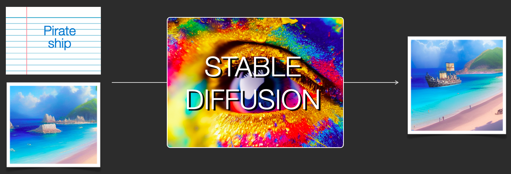
  <br />

</div>

让我们开始深入内部，因为这有助于解释各个组件、它们如何交互，以及图像生成选项/参数的含义。

## Stable Diffusion 的组件

Stable Diffusion 是一个由多个组件和模型组成的系统。它不是一个单一的整体模型。

当我们深入内部时，第一个观察是有一个文本理解组件，它将文本信息翻译为捕捉文本中概念的数值表示。

<div class="img-div-any-width" markdown="0">
  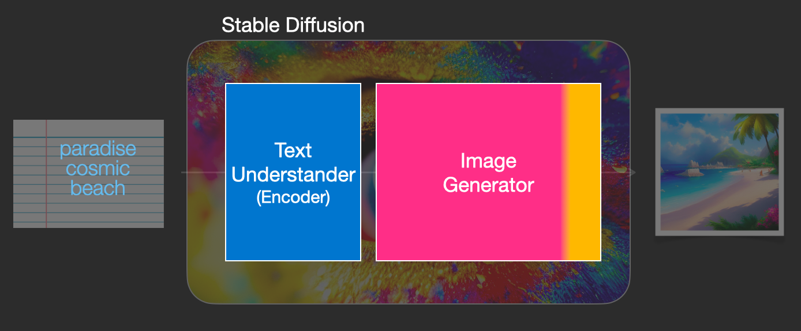
  <br />

</div>

我们先从高层视角开始，在文章后面会深入更多机器学习细节。不过可以说，这个文本编码器是一个特殊的 Transformer 语言模型（技术上说：是 CLIP 模型的文本编码器）。它接收输入文本并输出一个数字列表，表示文本中每个词/token（每个 token 一个向量）。

然后这些信息被传递给图像生成器，图像生成器本身也由几个组件组成。

<div class="img-div-any-width" markdown="0">
  
  <br />

</div>

图像生成器经历两个阶段：

1- **图像信息创建器**

这个组件是 Stable Diffusion 的核心秘密。相比之前的模型，很多性能提升都是在这里实现的。

这个组件运行多个步骤来生成图像信息。这就是 Stable Diffusion 接口和库中的 *steps* 参数，通常默认为 50 或 100。

图像信息创建器完全在*图像信息空间*（或 *latent* 空间）中工作。我们将在文章后面详细讨论这意味着什么。这个特性使其比之前在像素空间中工作的扩散模型更快。技术上说，这个组件由一个 UNet 神经网络和一个调度算法组成。

"diffusion"（扩散）这个词描述了在这个组件中发生的事情。它是逐步处理信息的过程，最终（由下一个组件，即图像解码器）生成高质量图像。

<div class="img-div-any-width" markdown="0">
  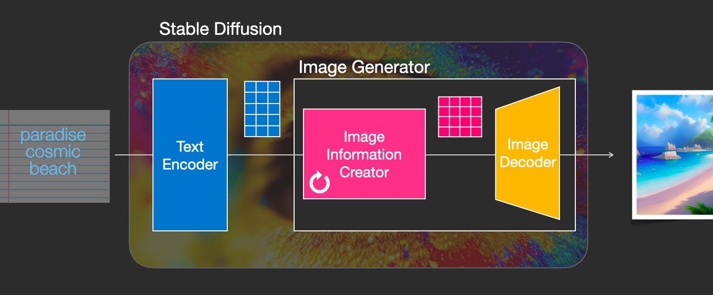
  <br />

</div>

2- **图像解码器**

图像解码器根据从信息创建器获得的信息绘制图片。它只在过程结束时运行一次，以产生最终的像素图像。


<div class="img-div-any-width" markdown="0">
  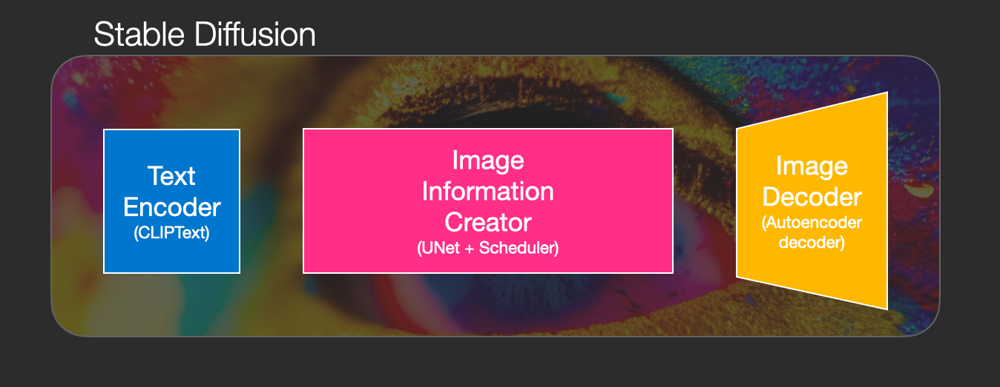
  <br />

</div>

由此我们可以看到构成 Stable Diffusion 的三个主要组件（每个都有自己的神经网络）：

- **ClipText** 用于文本编码。<br />
  输入：文本。<br />
  输出：77 个 token embedding 向量，每个 768 维。
  
- **UNet + Scheduler** 在信息（latent）空间中逐步处理/扩散信息。<br />
  输入：text embeddings 和一个由噪声组成的起始多维数组（结构化数字列表，也称为 *tensor*）。<br />
  输出：处理后的信息数组

- **Autoencoder Decoder** 使用处理后的信息数组绘制最终图像。<br />
输入：处理后的信息数组（维度：(4,64,64)）<br />
  输出：生成的图像（维度：(3, 512, 512)，即（红/绿/蓝，宽，高））


<div class="img-div-any-width" markdown="0">
  
  <br />

</div>

## Diffusion 到底是什么？

Diffusion 是在粉红色"图像信息创建器"组件内部发生的过程。有了表示输入文本的 token embeddings，以及一个随机的起始*图像信息数组*（也称为 *latents*），这个过程产生一个信息数组，供图像解码器用来绘制最终图像。

<div class="img-div-any-width" markdown="0">
  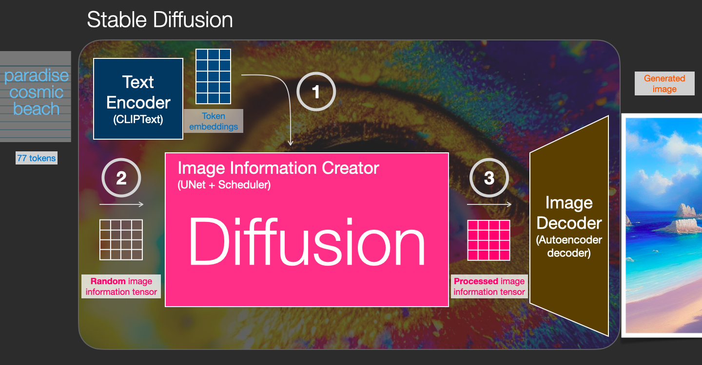
  <br />

</div>


这个过程是逐步进行的。每一步都添加更多相关信息。为了对这个过程有个直觉，我们可以检查随机的 latents 数组，看到它对应的是视觉噪声。在这种情况下的视觉检查就是将其通过图像解码器。


<div class="img-div-any-width" markdown="0">
  
  <br />

</div>

Diffusion 在多个步骤中进行，每一步对输入的 latents 数组进行操作，产生另一个更接近输入文本以及模型从训练图像中学到的所有视觉信息的 latents 数组。


<div class="img-div-any-width" markdown="0">
  
  <br />

</div>

我们可以可视化一组这样的 latents，看看每一步添加了什么信息。


<div class="img-div-any-width" markdown="0">
  
  <br />

</div>


这个过程观看起来相当震撼。

<div class="img-div-any-width" markdown="0">
<video height="auto" loop autoplay  controls>
  <source src="../images/stable-diffusion/diffusion-steps-all-loop.webm" type="video/webm">
  Your browser does not support the video tag.
</video>
</div>

在这个例子中，步骤 2 到 4 之间发生了一些特别令人着迷的事情。就好像轮廓从噪声中浮现出来一样。


<div class="img-div-any-width" markdown="0">
<video height="auto" loop autoplay  controls>
  <source src="../images/stable-diffusion/stable-diffusion-steps-2-4.webm" type="video/webm">
  Your browser does not support the video tag.
</video>
</div>

### Diffusion 如何工作
用扩散模型生成图像的核心思想依赖于这样一个事实：我们拥有强大的计算机视觉模型。给定一个足够大的数据集，这些模型可以学习复杂的操作。扩散模型通过将问题框架化为以下方式来实现图像生成：

假设我们有一张图像，我们生成一些噪声，然后将其添加到图像中。


<div class="img-div" markdown="0">
  
  <br />

</div>
这现在可以被视为一个训练样本。我们可以用同样的公式创建大量训练样本来训练我们图像生成模型的核心组件。

<div class="img-div" markdown="0">
  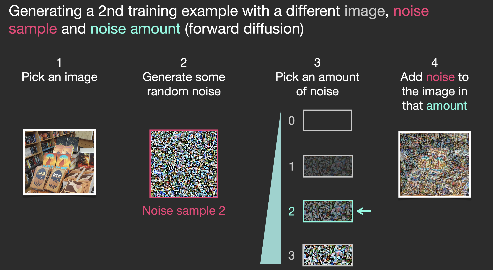
  <br />

</div>


虽然这个示例展示了从图像（量 0，无噪声）到完全噪声（量 4，完全噪声）的几个噪声量值，但我们可以轻松控制向图像添加多少噪声，因此可以将其分散到数十个步骤中，为训练数据集中的所有图像每张创建数十个训练样本。

<div class="img-div" markdown="0">
  
  <br />

</div>

有了这个数据集，我们可以训练噪声预测器，最终得到一个出色的噪声预测器，它在特定配置下运行时实际上能创建图像。如果你有机器学习经验，训练步骤应该看起来很熟悉：


<div class="img-div" markdown="0">
<a href="./images/stable-diffusion/stable-diffusion-u-net-noise-training-step.png">
  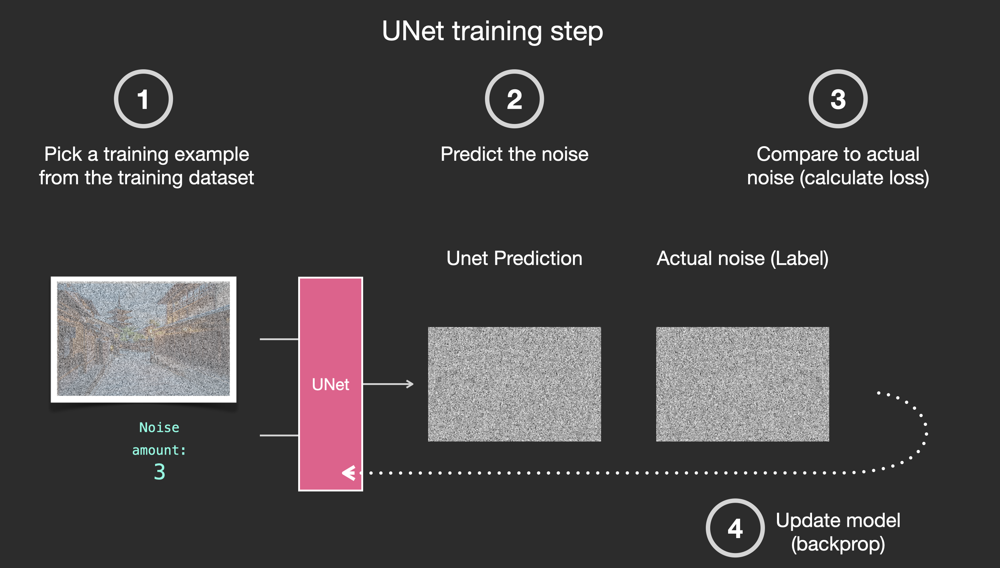
  </a><br />

</div>

现在让我们看看这如何生成图像。

### 通过去除噪声来绘制图像

训练好的噪声预测器可以接收一张有噪声的图像和去噪步骤编号，并能预测一片噪声。
<div class="img-div" markdown="0">
  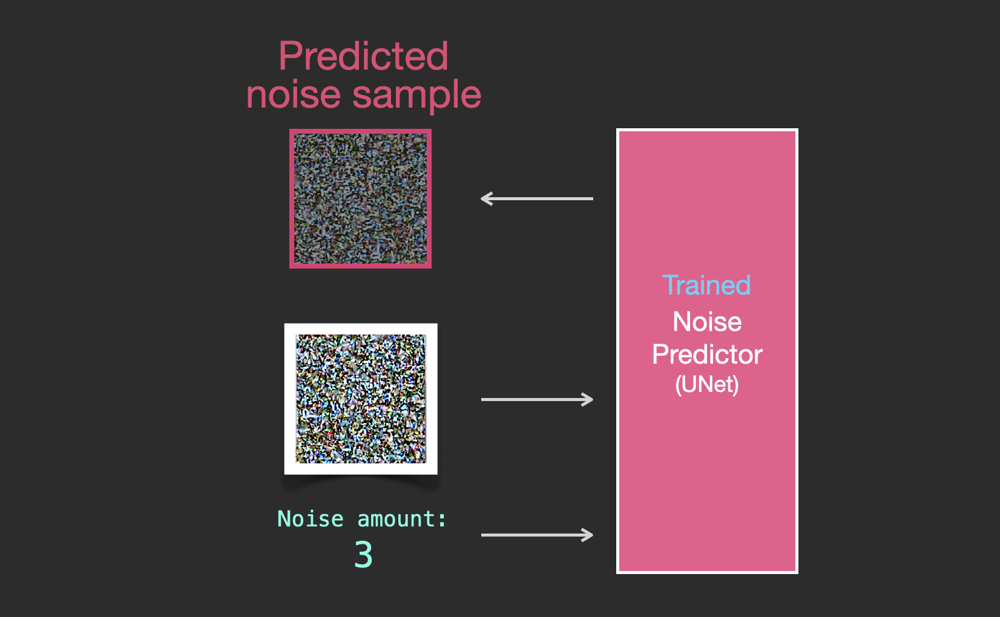
  <br />

</div>

预测的采样噪声使得如果我们将其从图像中减去，就会得到一张更接近模型训练图像的图像（不是训练图像本身，而是其*分布*——一个像素排列的世界，在那里天空通常是蓝色的且在地面之上，人有两只眼睛，猫看起来是某种样子——尖耳朵且明显不屑一顾）。

<div class="img-div" markdown="0">
  <a href="./images/stable-diffusion/stable-diffusion-denoising-step-2v2.png"></a>
  <br />

</div>

如果训练数据集是美学上令人愉悦的图像（例如 Stable Diffusion 训练所用的 [LAION Aesthetics](https://laion.ai/blog/laion-aesthetics/)），那么生成的图像往往也会在美学上令人愉悦。如果我们用 logo 图像来训练它，就会得到一个生成 logo 的模型。

<div class="img-div" markdown="0">
<a href="./images/stable-diffusion/stable-diffusion-image-generation-v2.png">
  
</a>
  <br />

</div>

这就是扩散模型图像生成的描述，主要如 [Denoising Diffusion Probabilistic Models](https://arxiv.org/abs/2006.11239) 中所述。现在你有了对 diffusion 的直觉，就了解了不仅 Stable Diffusion，还有 Dall-E 2 和 Google Imagen 的主要组件。

注意我们到目前为止描述的扩散过程在生成图像时没有使用任何文本数据。所以如果我们部署这个模型，它会生成好看的图像，但我们没有办法控制它生成的是金字塔、猫还是其他什么东西。在接下来的章节中，我们将描述如何将文本纳入这个过程以控制模型生成什么类型的图像。

## 加速：在压缩（Latent）数据上进行 Diffusion 而非在像素图像上

为了加速图像生成过程，Stable Diffusion 论文不是在像素图像本身上运行扩散过程，而是在图像的压缩版本上运行。[论文](https://arxiv.org/abs/2112.10752) 将此称为"进入 Latent 空间"。

这种压缩（以及后续的解压缩/绘制）通过 autoencoder 完成。Autoencoder 使用其 encoder 将图像压缩到 latent 空间，然后仅使用压缩后的信息通过 decoder 重建图像。

<div class="img-div" markdown="0">
  
  <br />

</div>

现在前向扩散过程在压缩后的 latents 上进行。噪声片段是应用于这些 latents 的噪声，而不是像素图像。因此噪声预测器实际上是被训练来预测压缩表示（latent 空间）中的噪声。

<div class="img-div" markdown="0">
<a href="./images/stable-diffusion/stable-diffusion-latent-forward-process-v2.png">
  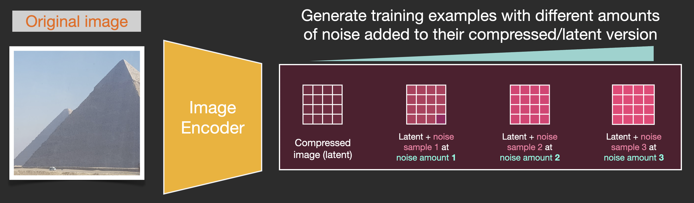
</a>
  <br />

</div>

前向过程（使用 autoencoder 的 encoder）是我们生成用于训练噪声预测器的数据的方式。一旦训练完成，我们可以通过运行反向过程（使用 autoencoder 的 decoder）来生成图像。


<div class="img-div" markdown="0">
<a href="./images/stable-diffusion/stable-diffusion-forward-and-reverse-process-v2.png">
  
</a>
  <br />

</div>


这两个流程就是 LDM/Stable Diffusion 论文图 3 中展示的内容：

<div class="img-div" markdown="0">
  
  <br />

</div>

这张图还展示了"conditioning"组件，在这种情况下就是描述模型应该生成什么图像的文本 prompt。让我们深入研究文本组件。

### 文本编码器：一个 Transformer 语言模型

一个 Transformer 语言模型被用作语言理解组件，接收文本 prompt 并产生 token embeddings。发布的 Stable Diffusion 模型使用 ClipText（一个[基于 GPT 的模型](/illustrated-gpt2/)），而论文使用的是 [BERT](/illustrated-bert/)。

Imagen 论文表明语言模型的选择是很重要的。换用更大的语言模型对生成图像质量的影响比使用更大的图像生成组件更显著。

<div class="img-div" markdown="0">
  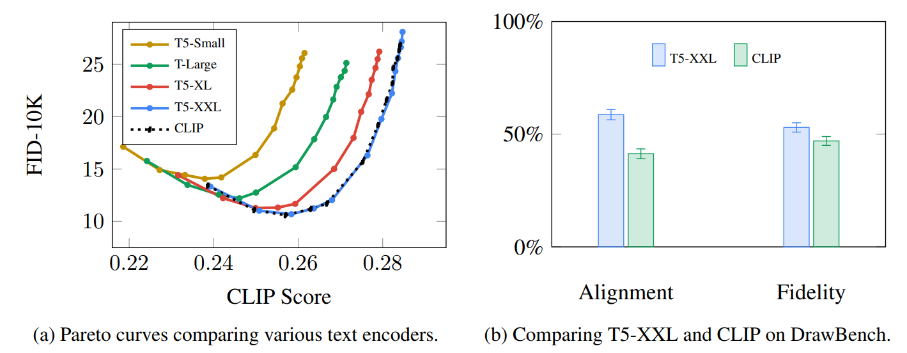
  <br />

  更大/更好的语言模型对图像生成模型的质量有显著影响。来源：<a href="https://arxiv.org/abs/2205.11487">Google Imagen paper by Saharia et. al.</a>，图 A.5。

</div>

早期的 Stable Diffusion 模型直接使用了 OpenAI 发布的预训练 ClipText 模型。未来的模型可能会切换到新发布的、大得多的 [OpenCLIP](https://laion.ai/blog/large-openclip/) CLIP 变体（2022年11月更新：确实如此，[Stable Diffusion V2 使用了 OpenClip](https://stability.ai/blog/stable-diffusion-v2-release)）。这批新模型包含最大达 354M 参数的文本模型，而 ClipText 只有 63M 参数。

#### CLIP 是如何训练的

CLIP 在一个包含图像及其描述的数据集上训练。想象一个这样的数据集，只不过有 4 亿张图像及其描述：

<div class="img-div" markdown="0">
  
  <br />
  图像及其描述的数据集。
</div>

实际上，CLIP 是在从网络爬取的图像及其 "alt" 标签上训练的。

CLIP 是图像编码器和文本编码器的组合。它的训练过程可以简化为：取一张图像和它的描述。我们分别用图像编码器和文本编码器对它们进行编码。

<div class="img-div" markdown="0">
  
  <br />
  
</div>

然后我们用余弦相似度比较得到的 embeddings。训练开始时，即使文本正确描述了图像，相似度也会很低。

<div class="img-div" markdown="0">
  
  <br />
  
</div>

我们更新两个模型，使得下次我们对它们进行编码时，得到的 embeddings 是相似的。

<div class="img-div" markdown="0">
  
  <br />
  
</div>


通过在数据集上重复这个过程并使用大 batch size，我们最终使编码器能够产生这样的 embeddings：一张狗的图片和句子"a picture of a dog"是相似的。就像在 [word2vec](/illustrated-word2vec/) 中一样，训练过程也需要包含图像和描述不匹配的**负样本**，模型需要给它们分配低相似度分数。

## 将文本信息输入图像生成过程

为了让文本成为图像生成过程的一部分，我们需要调整噪声预测器以使用文本作为输入。


<div class="img-div" markdown="0">
<a href="./images/stable-diffusion/stable-diffusion-unet-inputs-v2.png">
  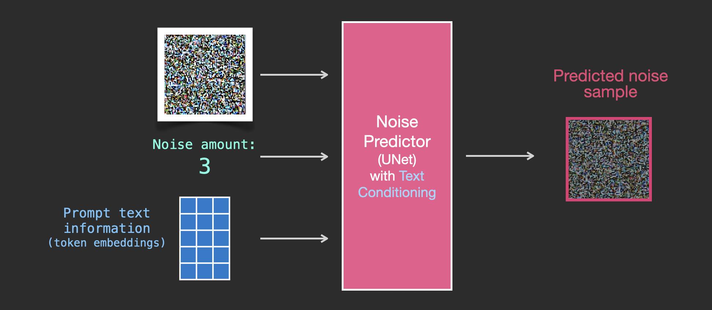
  </a><br />

</div>


我们的数据集现在包含编码后的文本。由于我们在 latent 空间中操作，输入图像和预测的噪声都在 latent 空间中。

<div class="img-div" markdown="0">
  
  <br />

</div>

为了更好地理解文本 token 在 Unet 中是如何使用的，让我们更深入地看看 Unet 内部。

### Unet 噪声预测器的层（无文本）

让我们先看一个不使用文本的扩散 Unet。它的输入和输出看起来像这样：

<div class="img-div-any-width" markdown="0">
  
  <br />

</div>

在内部，我们可以看到：

* Unet 是一系列用于变换 latents 数组的层
* 每一层对前一层的输出进行操作
* 一些输出通过残差连接被输入到网络后面的处理中
* timestep 被转换为一个 time step embedding 向量，这就是在各层中被使用的内容


<div class="img-div-any-width" markdown="0">
  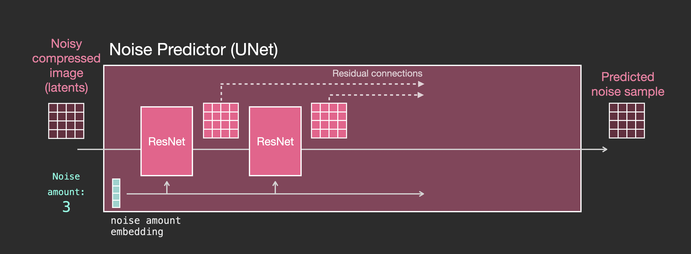
  <br />

</div>


### 带文本的 Unet 噪声预测器的层


现在让我们看看如何修改这个系统以包含对文本的 attention。

<div class="img-div-any-width" markdown="0">
  
  <br />

</div>

为了支持文本输入（技术术语：text conditioning），我们需要对系统做的主要改变是在 ResNet block 之间添加一个 attention 层。


<div class="img-div-any-width" markdown="0">
  
  <br />

</div>

注意 ResNet block 不直接查看文本。但 attention 层将这些文本表示融合到 latents 中。现在下一个 ResNet 就可以在处理中利用已融合的文本信息了。

## 结论

希望这篇文章让你对 Stable Diffusion 的工作原理有了一个良好的初步直觉。还涉及许多其他概念，但我相信一旦你熟悉了上面的构建模块，它们就更容易理解了。下面的资源是我发现有用的下一步学习材料。如有任何更正或反馈，请在 <a href="https://twitter.com/JayAlammar">Twitter</a> 上联系我。


## 资源

* 我有一个[一分钟 YouTube 短片](https://youtube.com/shorts/qL6mKRyjK-0?feature=share)关于使用 [Dream Studio](https://beta.dreamstudio.ai/) 用 Stable Diffusion 生成图像。
* [Stable Diffusion with 🧨 Diffusers](https://huggingface.co/blog/stable_diffusion)
* [The Annotated Diffusion Model](https://huggingface.co/blog/annotated-diffusion)
* [How does Stable Diffusion work? – Latent Diffusion Models EXPLAINED](https://www.youtube.com/watch?v=J87hffSMB60) [视频]
* [Stable Diffusion - What, Why, How?](https://www.youtube.com/watch?v=ltLNYA3lWAQ) [视频]
* [High-Resolution Image Synthesis with Latent Diffusion Models](https://ommer-lab.com/research/latent-diffusion-models/) [Stable Diffusion 论文]
* 如需更深入了解算法和数学，参见 Lilian Weng 的 [What are Diffusion Models?](https://lilianweng.github.io/posts/2021-07-11-diffusion-models/)
* 观看 [fast.ai 出品的 Stable Diffusion 精彩视频](https://www.youtube.com/watch?v=_7rMfsA24Ls&ab_channel=JeremyHoward)


## 致谢

感谢 Robin Rombach、Jeremy Howard、Hamel Husain、Dennis Soemers、Yan Sidyakin、Freddie Vargus、Anna Golubeva 以及 [Cohere For AI](https://cohere.for.ai/) 社区对本文早期版本的反馈。

## 贡献
请帮助我改进这篇文章。可能的方式：

* 在 [Twitter](https://twitter.com/JayAlammar) 上发送反馈或更正，或提交 [Pull Request](https://github.com/jalammar/jalammar.github.io)
* 通过为图片建议 caption 和 alt-text 来帮助提高文章的可访问性（最好以 pull request 方式）
* 翻译为其他语言并发布到你的博客上。将链接发给我，我会在这里添加链接。之前文章的译者都提到翻译过程让他们对概念理解得更加深入。


## 讨论

如果你有兴趣讨论图像生成模型与语言模型的交叉领域，欢迎在 [Cohere Discord 社区](https://discord.gg/co-mmunity) 的 #images-and-words 频道发帖。在那里我们讨论交叉领域，包括：

* 微调语言模型以产生好的图像生成 prompt
* 使用 LLM 拆分图像描述 prompt 的主体和风格组件
* Image-to-prompt（通过 [Clip Interrogator](https://colab.research.google.com/github/pharmapsychotic/clip-interrogator/blob/main/clip_interrogator.ipynb) 等工具）

## 引用

如果你发现这项工作对你的研究有帮助，请按如下方式引用：

<div class="cite" markdown="1">


```code
@misc{alammar2022diffusion, 
  title={The Illustrated Stable Diffusion},
  author={Alammar, J},
  year={2022},
  url={https://jalammar.github.io/illustrated-stable-diffusion/}
}
```

</div>
