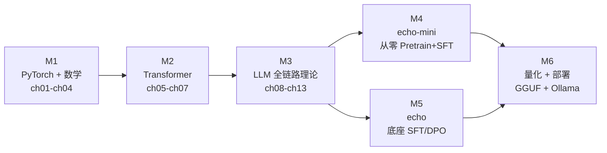

# llm01

LLM 入门课件 + Echo 对话模型双线产出。

## 是什么

双线产出：

- **课件 + 练习**：从 PyTorch / 数学基础到 Transformer 全链路 LLM 知识
- **Echo 对话模型**：双产物
  - `echo-mini`：从零 Pretrain → SFT 全链路走通的迷你模型（教学价值）
  - `echo`：基于开源底座 SFT/DPO 出来的可对话模型（实用价值）

详细愿景与决策见 [`Doc/DesignDoc/00-startup-proposal.md`](Doc/DesignDoc/00-startup-proposal.md)。

## 快速开始

### 前置

- Python 3.12（minor 锁定，patch 由本地 pyenv/uv 选）
- [uv](https://docs.astral.sh/uv/)（依赖管理）
- 系统环境：
  - Windows: CUDA 12+, 显存 8G+
  - Linux: CUDA 12+, 显存 8G+
  - macOS: Apple Silicon（MPS）

### 安装

```bash
# Windows
uv sync --extra dev --extra courseware --extra echo-mini --extra echo --extra train-cuda

# Mac (Apple Silicon)
uv sync --extra dev --extra courseware --extra echo-mini --extra echo --extra train-mps

# Linux
uv sync --extra dev --extra courseware --extra echo-mini --extra echo --extra train-cuda
```

> `llama-cpp-python` 拆到独立的 `deploy-llamacpp` extras，M6 部署阶段再按需装；
>
> Win 下若编译失败，参考 [`Doc/DesignDoc/02-deps-compatibility.md`](Doc/DesignDoc/02-deps-compatibility.md) §5。

### 自检

每次切换机器、上机第一件事：

```bash
uv run python scripts/doctor.py
```

### 文档站（MkDocs）

**线上**：<https://yangfch3.github.io/llm01/>（push main 后由 GitHub Actions 自动部署）

**本地预览**：

```bash
uv run python scripts/docs_serve.py
```

浏览器打开 `http://127.0.0.1:8000` 即可。

> 站点工具链与项目主依赖隔离，独立装在 `Misc/mkdocs/.venv-docs/`，依赖锁见 `Misc/mkdocs/requirements-docs.txt`。
>
> 首次本地预览前需执行：
> ```bash
> cd Misc/mkdocs && uv venv .venv-docs && uv pip install --python .venv-docs -r requirements-docs.txt
> ```

## 目录导览

```
Doc/
├─ DesignDoc/        根基文档（策划案 / 计划书 / 专题）
├─ Courseware/       课件（章节 markdown）
└─ UserDraft/        历史输入（只追加不改）

Playground/          配套练习代码（与课件 ch## 一一对应）

Echo/
├─ echo-mini/        从零教学产物
├─ echo/             开源底座微调产物
└─ shared/           两者共用工具（device.py 等）

scripts/             跨产物脚本（doctor.py 等）
```

详细约定见 [`Doc/DesignDoc/00-startup-proposal.md`](Doc/DesignDoc/00-startup-proposal.md) §5。

## 跨平台协作

- 训练**生产配置锁 Windows**，Mac 跑 tiny 配置做代码验证
- 学习/编码/推理/量化/部署 双端等价
- 切机器前 `git push`，上机 `git pull` + `scripts/doctor.py`
- 大文件不入 Git：数据走脚本下载，权重走 HuggingFace Hub
- 详见 [`Doc/DesignDoc/03-sync-strategy.md`](Doc/DesignDoc/03-sync-strategy.md)

> 补充：Linux CUDA 12+ 下也已验证全流程（学习/编码/推理/量化/部署）可跑

## 学习路径

按里程碑顺序推进，详见 [`Doc/DesignDoc/01-project-plan.md`](Doc/DesignDoc/01-project-plan.md)：

| 阶段 | 内容 |
|---|---|
| M1 | PyTorch + 浅层数学 + 神经网络基础（ch01–ch04） |
| M2 | 注意力 + Transformer 架构 + 生成策略（ch05–ch07） |
| M3 | 分词器 / 预训练 / SFT / 对齐 / 评测 / 部署（ch08–ch13） |
| M4 | echo-mini 全链路落地 |
| M5 | echo 微调落地 |
| M6 | 对齐与量化部署 |



**推荐：全链路走完后，再回看一遍文档站的课件（M1-M3），你将对整个 LLM 知识体系、全链路有更深刻的认知。**

任务清单见 [`Doc/DesignDoc/tasks.md`](Doc/DesignDoc/tasks.md)。

## Echo 成果展示

```text
User: "写一句晚安祝福"
Echo: 晚安，希望你今天过得充实快乐。

User: 10 * 5 + 4 = ?
Echo: 10 * 5 + 4 = 54

User: 熊猫主要吃什么？
Echo: 熊猫主要以竹子为食，它们是食竹动物。熊猫的消化系统特别适合消化竹子，因为它们的胃中有一种特殊的细菌，可以分解竹子中的纤维素。熊猫通常每天吃18-20磅（8-9千克）的竹子，它们会花费大部分时间在树上，用它们的牙齿和爪子撕开竹子。熊猫是独居动物，它们通常独自生活，只有在繁殖季节才会与伴侣在一起。熊猫是濒危物种，它们的数量正在下降，因此保护它们的栖息地和繁殖是至关重要的。
```

## FAQ

**Q: 学习路径怎么安排？非要按 M1 → M6 顺序吗？**
理论章节（M1–M3）严格顺序推进，前置缺失会很难看懂。Echo 落地（M4–M6）只要求 M3
读完。已会基础的可直接从 M3 / M4 开始。

**Q: 没有 GPU / 显存不够能跑通吗？**
- 课件 + 练习（ch01–ch08）：CPU 可跑
- ch09 之后涉及训练：~~~CPU 太慢~~~ 至少 8GB 显存（练习用 tiny 配置）
- Echo SFT/DPO 训练：12GB 显存起步，DPO 需 24GB
- 推理 + 部署：量化后的 echo Q4_K_M 在 8GB 卡 / Apple Silicon 都能跑

**Q: 训练遇到 OOM / segfault / 编码错乱怎么办？**
先查 [`Doc/DesignDoc/troubleshooting.md`](Doc/DesignDoc/troubleshooting.md)，那里
按时间倒序记录了所有踩过的跨平台坑（trl pyarrow segfault、Win GBK 编码、DPO 显存
爆炸、SFT mode collapse 等），每条都有现象 + 根因 + 解决三段式。

**Q: Win 和 Mac 都能跑吗？**
能，但定位不同：训练**生产配置锁 Windows**（CUDA），Mac 跑 tiny 配置做代码验证；
学习/编码/推理/量化/部署双端等价。详见 [`Doc/DesignDoc/03-sync-strategy.md`](Doc/DesignDoc/03-sync-strategy.md)。

## License

[MIT License](LICENSE) © 2026 yangfch3
